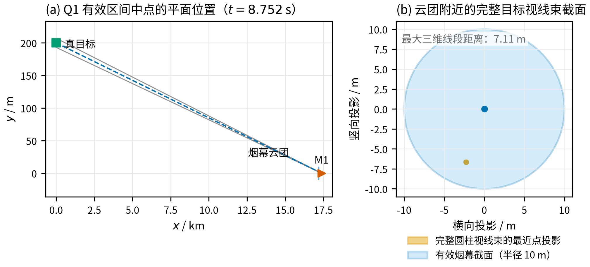
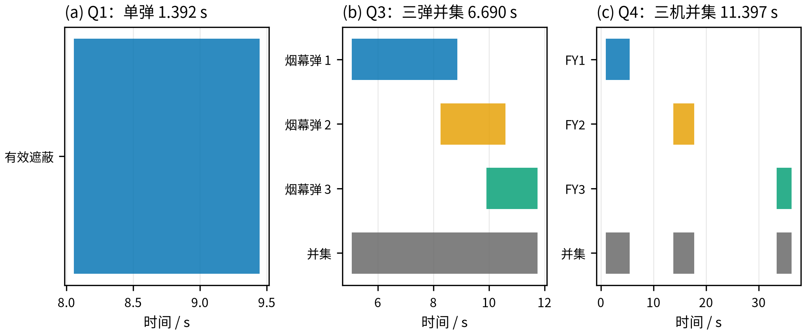
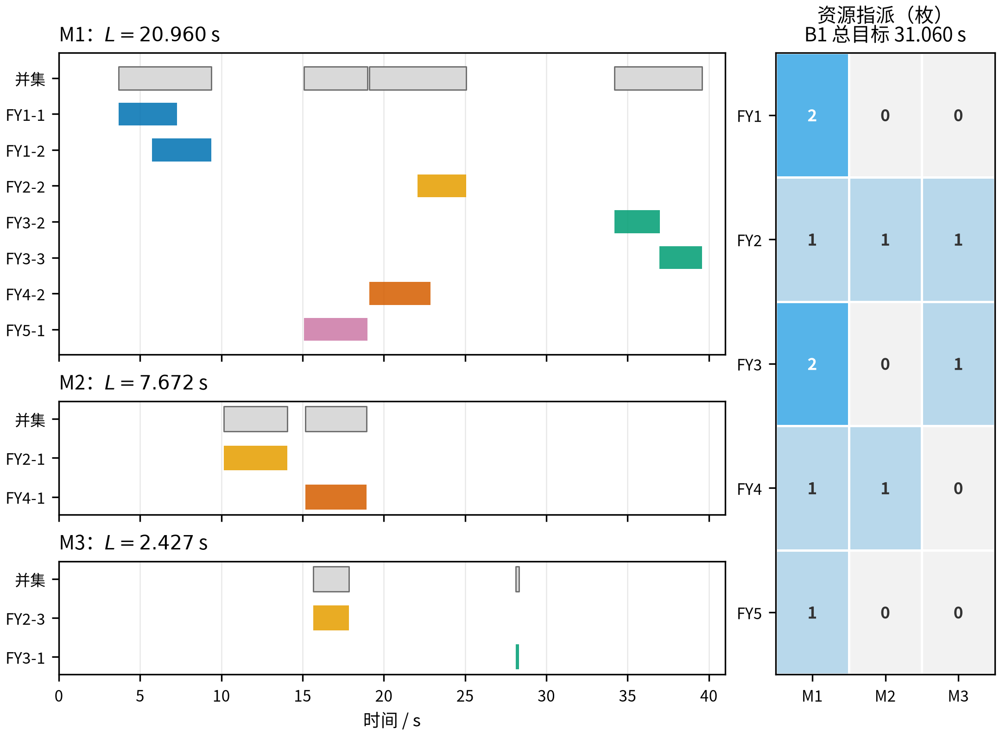

# 烟幕干扰弹的投放策略：基于完整圆柱目标视线遮蔽的时空协同模型

## 摘要

针对来袭导弹、无人机与固定目标之间的烟幕干扰弹投放问题，本文建立了“确定性三维运动学—完整目标视线几何—时间区间测度”的联合模型。将真目标保留为半径 7 m、高 10 m 的有限圆柱，而不是用代表点替代；对每一时刻的导弹位置和烟幕云团位置，计算云团到导弹与目标表面全部视线线段的最大距离，并以该距离不超过 10 m 作为完整遮蔽判据。对于多枚烟幕弹，采用有效时间区间的并集计量，避免重叠时间重复累计；问题 5 按每枚烟幕弹的单一指派对象计入正式目标。

在此基础上，问题 1 的有效遮蔽区间为 $[8.0564,9.4481]$ s，时长为 1.3916 s；问题 2 得到航向角 $5.1443^\circ$、速度 140.0000 m/s 的单弹方案，时长为 4.5881 s；问题 3 的三弹共享航迹方案形成连续并集，时长为 6.6897 s；问题 4 的三机协同方案形成三个不相交区间，并集时长为 11.3975 s。问题 5 最终使用 11 枚烟幕弹，按 M1、M2、M3 分别获得 20.9604 s、7.6722 s 和 2.4270 s 的有效遮蔽，正式目标值为 31.0596 s。多分辨率目标表面采样、区间端点求根、多起点搜索和局部扰动复核支持了上述数值。文中优化结果均表示在所记录搜索与验证设置下得到的较优可行方案，不作全局最优证明。

**关键词：** 烟幕干扰；无人机协同；视线遮蔽；时间区间并集；资源指派

## 一、问题重述

### 1.1 任务与坐标系

题目给出一个以假目标为原点的三维直角坐标系，水平面为 $xy$ 平面。真目标为竖直圆柱，其下底面圆心为 $(0,200,0)$，半径为 7 m，高度为 10 m。雷达发现来袭导弹的时刻记为 $t=0$，此后导弹以 300 m/s 沿指向假目标的直线飞行；无人机可以立即选择水平航向和 70～140 m/s 的速度，并在整个任务期间保持该航向、速度和飞行高度不变。题面给出的初始位置如表 1 所示，坐标单位均为 m。^[1]^

**表 1  导弹与无人机初始位置**

| 类别 | 编号 | 初始位置 $(x,y,z)$ |
|:---:|:---:|:---:|
| 导弹 | M1 | $(20000,0,2000)$ |
| 导弹 | M2 | $(19000,600,2100)$ |
| 导弹 | M3 | $(18000,-600,1900)$ |
| 无人机 | FY1 | $(17800,0,1800)$ |
| 无人机 | FY2 | $(12000,1400,1400)$ |
| 无人机 | FY3 | $(6000,-3000,700)$ |
| 无人机 | FY4 | $(11000,2000,1800)$ |
| 无人机 | FY5 | $(13000,-2000,1300)$ |

烟幕弹脱离无人机后做平抛运动，起爆时立即形成半径为 10 m 的球状云团；云团中心以 3 m/s 的速度匀速下沉，起爆后 20 s 内具有有效遮蔽能力。同一架无人机相邻两次投放至少间隔 1 s。需要分别设计单弹、同机多弹、多机协同以及多导弹资源分配策略，使有效遮蔽时间尽可能长。

### 1.2 子问题结构

问题 1 给定 FY1 的航向、速度、投放时刻和起爆延时，要求计算单枚烟幕弹对 M1 的有效遮蔽时长，是运动学和几何判据的基础检验。问题 2 在单弹场景下优化航向、速度和时序。问题 3 在共享航向和速度的条件下安排 FY1 的三次投放，目标是三枚烟幕弹遮蔽区间的并集。问题 4 将单弹扩展到三架无人机，重点是不同平台的时空衔接。问题 5 同时面对三枚导弹和有限弹药，除航迹与时序外还要决定烟幕弹的指派对象。

## 二、问题分析

导弹位置和无人机位置均由少量连续变量决定，烟幕弹起爆点又由投放时刻、起爆延时和无人机运动共同确定。因此，问题的核心不是单独寻找一个“离目标最近”的点，而是让运动中的云团在一段时间内持续位于来袭导弹与真目标之间。

有限尺寸目标带来两个直接影响：第一，导弹到圆柱不同位置的视线不同，云团必须同时遮断完整目标的可见视线束；第二，单枚烟幕弹的遮蔽通常只在某一段时间内成立，多枚烟幕弹之间可能重叠，也可能存在间隔。故本文把每枚烟幕弹的效果表示为时间区间，并在同一导弹上取区间并集。

问题 2 采用几何引导的连续搜索来缩小候选范围，但正式目标始终由完整圆柱视线模型计算。问题 3 的共同航向和速度使三枚烟幕弹的空间位置相互耦合，需同时优化三组投放时刻和起爆延时。问题 4 的三段有效区间在最终方案中相互分离，可以在独立求得单机候选后再按时间并集组合。问题 5 则采用逐弹单一导弹指派，正式目标为三枚导弹各自有效区间并集时长之和；烟幕弹对未指派导弹的实际物理遮蔽只作选后复算。

## 三、模型假设与符号说明

### 3.1 基本假设

1. 导弹发现时刻为 $t=0$，导弹始终沿初始位置指向假目标的直线以 300 m/s 匀速飞行；当导弹到达假目标后，不再计入来袭过程。
2. 无人机在 $t=0$ 瞬时确定水平航向和速度，之后保持等高度、匀速直线飞行；烟幕弹投放后继承无人机的水平速度，竖直初速度为 0。
3. 烟幕云团在起爆瞬间形成半径 10 m 的球体，中心只按题面给出的 3 m/s 竖直下沉；云团寿命不超过 20 s，且云团中心落地后不再计入有效遮蔽。
4. 真目标按完整有限圆柱处理。某一时刻只有在云团球体与导弹到真目标表面每条视线线段均相交时，才认为真目标被完整遮蔽。
5. 计算中的目标表面采用确定性网格采样，遮蔽区间端点通过一维求根细化。该离散化用于数值计算，不改变目标、运动和遮蔽判据的连续定义。

### 3.2 符号说明

**表 2  主要符号**

| 符号 | 含义 | 单位或取值 |
|:---:|:---|:---:|
| $\mathbf m_j^0$ | 导弹 $M_j$ 初始位置 | m |
| $\mathbf f_i^0$ | 无人机 $FY_i$ 初始位置 | m |
| $\theta_i$ | 无人机水平航向角，逆时针为正 | $[0,360^\circ]$ |
| $v_i$ | 无人机速度 | $[70,140]$ m/s |
| $\tau_{ik}$ | 无人机 $i$ 第 $k$ 枚烟幕弹投放时刻 | s |
| $\delta_{ik}$ | 第 $k$ 枚烟幕弹起爆延时 | s |
| $b_{ik}$ | 起爆时刻，$b_{ik}=\tau_{ik}+\delta_{ik}$ | s |
| $\mathbf r_{ik}$ | 投放点 | m |
| $\mathbf e_{ik}$ | 起爆点 | m |
| $\mathbf c_{ik}(t)$ | $t$ 时刻云团中心 | m |
| $R$ | 烟幕有效半径 | 10 m |
| $L_j$ | 导弹 $M_j$ 的有效遮蔽时间并集测度 | s |

## 四、基础运动学与遮蔽判据

### 4.1 导弹与无人机运动

令 $O=(0,0,0)$ 为假目标位置。由于每枚导弹的速度方向始终指向 $O$，导弹 $M_j$ 的位置为

$$
\mathbf m_j(t)=\mathbf m_j^0\left(1-\frac{300t}{\lVert\mathbf m_j^0\rVert}\right),
\qquad 0\le t\le T_j,
$$

其中 $T_j=\lVert\mathbf m_j^0\rVert/300$ 为到达假目标的时刻。无人机 $FY_i$ 的水平单位航向向量为

$$
\mathbf u_i=(\cos\theta_i,\sin\theta_i,0),
$$

于是

$$
\mathbf f_i(t)=\mathbf f_i^0+v_it\mathbf u_i,
\qquad 70\le v_i\le140.
$$

### 4.2 烟幕弹与云团运动

烟幕弹在 $\tau_{ik}$ 时刻投放，投放点由无人机轨迹直接确定：

$$
\mathbf r_{ik}=\mathbf f_i^0+v_i\tau_{ik}\mathbf u_i.
$$

烟幕弹的水平速度继承无人机速度，起爆时刻为 $b_{ik}=\tau_{ik}+\delta_{ik}$，起爆点为

$$
\mathbf e_{ik}=\mathbf f_i^0+v_ib_{ik}\mathbf u_i
-\frac12g\delta_{ik}^2(0,0,1),
\qquad g=9.8\ \mathrm{m/s^2}.
$$

起爆后云团中心满足

$$
\mathbf c_{ik}(t)=\mathbf e_{ik}-3(t-b_{ik})(0,0,1),
\qquad b_{ik}\le t\le b_{ik}+20.
$$

除寿命限制外，还需满足 $t\le T_j$，以及 $t\le b_{ik}+e_{ik,z}/3$，其中 $e_{ik,z}$ 是起爆点高度。这样可以排除云团中心已经落地后的虚假遮蔽。

### 4.3 完整圆柱视线遮蔽模型

真目标表示为

$$
\mathcal T=\{(x,y,z):x^2+(y-200)^2\le7^2,\ 0\le z\le10\},
$$

记其表面为 $\mathcal S=\partial\mathcal T$。对目标表面任一点 $\mathbf q$，导弹与该点之间的视线线段记为 $[\mathbf m_j(t),\mathbf q]$。云团中心到该线段的距离可写成

$$
d\bigl(\mathbf c,[\mathbf m,\mathbf q]\bigr)
=\left\lVert\mathbf c-\left(\mathbf m+\lambda^*(\mathbf q-\mathbf m)\right)\right\rVert,
$$

其中

$$
\lambda^*=\operatorname{clip}_{[0,1]}
\left(\frac{(\mathbf c-\mathbf m)\cdot(\mathbf q-\mathbf m)}
{\lVert\mathbf q-\mathbf m\rVert^2}\right).
$$

定义完整目标所需的最大遮蔽半径为

$$
\rho_j(t;\mathbf c)=\max_{\mathbf q\in\mathcal S}
d\bigl(\mathbf c,[\mathbf m_j(t),\mathbf q]\bigr).
$$

若 $\rho_j(t;\mathbf c_{ik}(t))\le R$，则烟幕球同时与导弹到完整目标表面的所有视线线段相交，计为该时刻对 $M_j$ 的有效遮蔽。相反，只遮断目标的一部分视线时不计入完整遮蔽。

### 4.4 时间区间与优化目标

对烟幕弹 $(i,k)$ 和导弹 $M_j$，定义有效时间集合

$$
\mathcal C_{ik,j}=\left\{t\in\left[b_{ik},
\min\left(b_{ik}+20,T_j,b_{ik}+\frac{e_{ik,z}}3\right)\right]:
\rho_j(t;\mathbf c_{ik}(t))\le10\right\}.
$$

同一枚导弹的有效遮蔽时间为这些集合的并集测度

$$
L_j=\mu\left(\bigcup_{i,k}\mathcal C_{ik,j}\right),
$$

其中 $\mu([a,b])=b-a$。因此，多枚烟幕弹重叠的时间只计算一次，允许存在多个不连续区间。

问题 2 和问题 3 的目标分别为单枚烟幕弹的 $L_1$ 和 FY1 三枚烟幕弹的并集时长。问题 4 的目标为三架无人机对 M1 的时间并集。问题 5 按每枚烟幕弹的单一指派导弹计分，设 $a_{ik}\in\{1,2,3\}$ 为指派对象，则正式目标为

$$
\max\quad L_1+L_2+L_3,
\qquad
L_j=\mu\left(\bigcup_{(i,k):a_{ik}=j}\mathcal C_{ik,j}\right).
$$

所有方案还必须满足

$$
\tau_{ik}\ge0,\quad \delta_{ik}\ge0,\quad e_{ik,z}\ge0,
\quad \tau_{i,k+1}-\tau_{ik}\ge1.
$$

### 4.5 数值求解方法

由于有效区间的端点由视线束与烟幕球的接触关系决定，目标函数在不同遮蔽区间之间可能出现非光滑变化，本文采用无梯度搜索。问题 2 先在目标—导弹几何关系引导的参数空间中用差分进化算法^[2]^搜索候选，再用 Nelder–Mead 单纯形法^[3]^对直接策略变量作局部细化；问题 3 在共享航迹和投放间隔参数化下进行多起点差分进化；问题 4 对每架无人机独立产生单弹候选后按并集评价；问题 5 先建立有限指派的单弹基础，再对各机共享航迹、三弹时序和指派对象进行坐标式改进。

对每个候选，先在时间网格上定位 $\rho_j(t)-10$ 的符号变化，再用一维求根得到区间端点，最后在更密的目标表面网格上重新计算。这样，搜索阶段只负责产生候选，正式时长由同一套完整圆柱判据和区间并集计算，避免把搜索网格上的点数直接当作物理时长。

## 五、问题 1：给定投放方案的遮蔽时长

FY1 的初始位置为 $(17800,0,1800)$，以 120 m/s 沿假目标方向飞行，因此其水平速度为 $(-120,0,0)$。给定投放时刻 $\tau=1.5$ s、起爆延时 $\delta=3.6$ s，得到

$$
\mathbf r=(17620,0,1800),\qquad b=5.1\ \mathrm{s},
$$

$$
\mathbf e=(17188,0,1736.496).
$$

将导弹轨迹、云团下沉轨迹和完整圆柱表面视线判据代入遮蔽条件，得到有效遮蔽区间

$$
\mathcal C_{1,1,1}=[8.056445,9.448088]\ \mathrm{s}.
$$

因此

$$
L_1=9.448088-8.056445=1.391643\ \mathrm{s}.
$$

取该区间中点 $t=8.752$ s，图 1 左图给出了导弹、烟幕云团与真目标的平面关系，右图给出了完整圆柱视线束在云团附近的截面投影。图 2(a) 则直接显示了有效时间区间。

{width=100%}

图 1  左图中的中心视线用于标示空间关系，右图展示完整圆柱视线束最近点投影与半径 10 m 的有效烟幕截面；遮蔽判定使用完整视线束，而非单一中心视线。

## 六、问题 2：单枚烟幕弹的连续优化

### 6.1 几何引导的参数化

问题 2 的四个直接决策变量为 $\theta,v,b,\delta$。为提高连续搜索的有效性，先用三个几何参数描述起爆云团与目标—导弹视线的相对位置：起爆时刻 $b$、云团与导弹对齐时刻相对起爆时刻的延后量 $s$、以及目标中心到导弹位置连线上的比例 $\lambda$。令目标几何中心为 $\mathbf p_T=(0,200,5)$，在 $t=b+s$ 时令云团中心的水平位置接近

$$
\mathbf p_T+\lambda\bigl(\mathbf m_1(b+s)-\mathbf p_T\bigr),
$$

并把云团在这段时间内的下沉量 $3s$ 加回起爆点高度。由该候选起爆点反推出 FY1 所需的航向、速度和起爆延时，再用完整圆柱模型计算目标函数。这样，目标中心线只作为搜索引导，最终遮蔽时长仍由半径 7 m、高 10 m 的完整圆柱表面确定。

### 6.2 求解结果

在满足速度、起爆高度和来袭时间约束的条件下，得到当前搜索证据下的较优方案如下。

**表 3  问题 2 单弹策略**

| 参数 | 数值 |
|:---|---:|
| 航向角 $\theta$ | $5.144284^\circ$ |
| 速度 $v$ | $139.9999998$ m/s |
| 投放时刻 $\tau$ | $0.805429$ s |
| 起爆延时 $\delta$ | $0.122015$ s |
| 起爆时刻 $b$ | $0.927444$ s |
| 投放点 $\mathbf r$ | $(17912.306,10.111,1800.000)$ |
| 起爆点 $\mathbf e$ | $(17929.319,11.642,1799.927)$ |
| 有效遮蔽区间 | $[0.927531,5.515586]$ s |
| 有效遮蔽时长 | $4.588055$ s |

该方案的速度达到题面允许上界。将区间端点在更密的圆柱表面网格上重新求根，得到最大端点残差的绝对值为 $6.96\times10^{-13}$ m。5 组多起点、7 个速度上界切片和 400 次可行局部扰动均未发现比表 3 更长的候选；这些检验支持该方案作为当前搜索范围内的较优可行方案，但不能推出连续可行域上的全局最优性。

## 七、问题 3：FY1 三枚烟幕弹的投放策略

### 7.1 共享航迹与时序约束

三枚烟幕弹共享 FY1 的航向角和速度，只需分别决定投放时刻与起爆延时。为直接满足相邻投放间隔约束，令

$$
\tau_2=\tau_1+1+s_{12},\qquad
\tau_3=\tau_2+1+s_{23},\qquad s_{12},s_{23}\ge0.
$$

优化目标为三枚烟幕弹对 M1 的有效时间并集，而不是三条单弹时长之和：

$$
\max\ \mu\left(\mathcal C_{1,1,1}\cup\mathcal C_{1,2,1}\cup\mathcal C_{1,3,1}\right).
$$

共享航迹使三枚烟幕弹不能分解为三个彼此独立的单弹问题。由起爆点公式可得

$$
\mathbf e_k=\mathbf f_1^0+v(\tau_k+\delta_k)\mathbf u(\theta)
-\frac12g\delta_k^2\mathbf e_z.
$$

改变 $\theta$ 或 $v$ 会同时改变三枚烟幕弹的水平投放点和起爆点，而改变某一投放时刻还受到相邻投放至少间隔 1 s 的约束。此外，一枚烟幕弹的边际贡献取决于其区间与另外两枚的重叠程度，并不等于它单独使用时的有效时长。因此，求解时必须同时调整共享航迹与三组时序，使相邻云团在时间上形成有效接续。

### 7.2 投放结果

**表 4  问题 3 三枚烟幕弹策略**

| 烟幕弹 | $\theta$ | $v$ (m/s) | $\tau$ (s) | $\delta$ (s) | $b$ (s) | 投放点 $(x,y,z)$ (m) | 起爆点 $(x,y,z)$ (m) | 单弹有效区间 (s) |
|:---:|---:|---:|---:|---:|---:|:---|:---|:---|
| 1 | $179.617493^\circ$ | 131.324813 | 0.052704 | 3.516856 | 3.569560 | $(17793.079,0.046,1800.000)$ | $(17331.239,3.129,1739.395)$ | $[5.059331,8.864737]$ |
| 2 | $179.617493^\circ$ | 131.324813 | 2.701809 | 4.581549 | 7.283358 | $(17445.193,2.369,1800.000)$ | $(16843.536,6.385,1697.146)$ | $[8.253530,10.596924]$ |
| 3 | $179.617493^\circ$ | 131.324813 | 4.456293 | 5.461029 | 9.917322 | $(17214.791,3.907,1800.000)$ | $(16497.639,8.695,1653.868)$ | $[9.917322,11.749033]$ |

相邻投放间隔分别为 2.649105 s 和 1.754483 s，满足至少 1 s 的约束。三枚烟幕弹的单弹有效时长分别为 3.805406 s、2.343394 s 和 1.831712 s；由于区间相互交叠，合并后只有

$$
\mathcal C_3=[5.059331,11.749033]\ \mathrm{s},
\qquad L_1=6.689703\ \mathrm{s}.
$$

三段单弹区间首尾交叠，形成了从 5.059331 s 到 11.749033 s 的连续遮蔽链。前一枚云团尚未失效时，后一枚已开始提供遮蔽，因此各弹的作用是接续并延长并集，而不是分别追求最大的单弹时长。在扩大航迹候选范围的复核中，三枚烟幕弹均保留了正的边际贡献，这进一步说明该共享航迹方案不能由三个单弹最优解简单拼接得到。

## 八、问题 4：三架无人机协同干扰 M1

### 8.1 协同目标

每架无人机各投放一枚烟幕弹，每架的航向、速度、投放时刻和起爆延时独立决定，整体目标为

$$
\max\ \mu\left(\bigcup_{i\in\{1,2,3\}}\mathcal C_{i,1,1}\right).
$$

三架无人机之间没有共享航向、速度或投放间隔约束，平台间的耦合仅来自时间并集中的重叠扣除。记第 $i$ 架无人机的决策为 $\mathbf x_i$，则整体目标为

$$
F(\mathbf x_1,\mathbf x_2,\mathbf x_3)
=\mu\left(\mathcal C_1(\mathbf x_1)\cup
\mathcal C_2(\mathbf x_2)\cup\mathcal C_3(\mathbf x_3)\right).
$$

若三个候选区间两两分离，并且局部扰动后仍不发生重叠，则在该邻域内有 $F=\sum_i\mu(\mathcal C_i)$，逐平台提高单弹时长与提高整体并集时长等价。由此，本文先分别寻找各平台的单弹候选，再用时间并集评价组合；若候选区间发生重叠，则上述等价关系不再成立，必须改为联合调整。

### 8.2 投放结果

**表 5  问题 4 三机协同策略**

| 无人机 | 航向角 $\theta$ | 速度 $v$ (m/s) | $\tau$ (s) | $\delta$ (s) | $b$ (s) | 投放点 $(x,y,z)$ (m) | 起爆点 $(x,y,z)$ (m) | 有效区间 (s) | 时长 (s) |
|:---:|---:|---:|---:|---:|---:|:---|:---|:---|---:|
| FY1 | $5.144284^\circ$ | 139.9999998 | 0.805429 | 0.122015 | 0.927444 | $(17912.306,10.111,1800.000)$ | $(17929.319,11.642,1799.927)$ | $[0.927531,5.515586]$ | 4.588055 |
| FY2 | $306.752521^\circ$ | 135.787385 | 8.369496 | 4.225056 | 12.594553 | $(12680.019,489.427,1400.000)$ | $(13023.304,29.756,1312.530)$ | $[13.787732,17.747016]$ | 3.959284 |
| FY3 | $75.927679^\circ$ | 105.318704 | 28.734108 | 1.210216 | 29.944324 | $(6735.819,-64.580,700.000)$ | $(6766.810,59.054,692.823)$ | $[33.416073,36.266194]$ | 2.850121 |

三段区间之间的空档分别为 8.272146 s 和 15.669057 s，因而不存在跨平台的时间重叠，也满足上述独立组合成立的条件。最终并集为

$$
\mathcal C_4=[0.927531,5.515586]\cup[13.787732,17.747016]
\cup[33.416073,36.266194]\ \mathrm{s},
$$

$$
L_1=4.588055+3.959284+2.850121=11.397460\ \mathrm{s}.
$$

对各平台候选进行多起点和可行局部扰动复核，均未发现超过对应基线的有效时长。由于“并集等于分项之和”只在区间保持分离时成立，该结果支持独立组合策略在当前解邻域和搜索证据下的稳定性，但不意味着整个多机连续可行域都可全局分解，也不构成全局最优证明。

{width=100%}

图 2  (a) 问题 1 的单弹区间；(b) 问题 3 的三弹区间及并集；(c) 问题 4 的三机区间及并集。并集行只对重叠区间计一次。

## 九、问题 5：五架无人机对三枚导弹的资源配置

### 9.1 正式计分口径

每枚实际使用的烟幕弹只指派给 M1、M2、M3 中的一枚，记为 $a_{ik}$。对导弹 $M_j$，正式有效时长只合并指派给 $M_j$ 的烟幕弹产生的区间，即前述正式目标中的 $L_j$。这样，优化目标与结果表中的单一“干扰的导弹编号”一致。

一枚烟幕弹在物理上可能同时遮断其他导弹的视线。为避免把任务指派和物理效果混为一谈，对最终方案另外计算所有烟幕弹对三枚导弹的实际遮蔽并集，但该复算不参与方案排序。最终方案的这一补充复算与正式 B1 结果相同，因此没有附加的跨目标时长。

### 9.2 共享航迹与资源指派

问题 5 不能把若干单弹最优策略直接拼接。首先，同一架无人机的多枚烟幕弹共享航向和速度，各自的单弹最优航迹通常无法同时实现；其次，相邻投放至少间隔 1 s，单弹时序之间存在硬约束；最后，正式目标按导弹分别计算区间并集，新增烟幕弹对导弹 $M_j$ 的实际边际贡献为

$$
\Delta_{ik,j}=\mu\left(\mathcal U_j\cup\mathcal C_{ik,j}\right)-\mu(\mathcal U_j),
$$

其中 $\mathcal U_j$ 是该导弹已有的遮蔽区间。$\Delta_{ik,j}$ 取决于当前覆盖和指派对象，可能远小于该弹单独使用时的时长。因此，按单弹时长排序或逐弹选择并不能保证得到较好的整体配置。

求解时先用单弹几何候选建立指派基础，并在继承的固定航迹上扩展多弹时序；该固定航迹方案经完整表面模型复算，正式目标为 30.921158 s。随后保持其他无人机方案不变，逐机联合调整共享航迹、三弹投放与起爆时序以及指派对象，并复核所有区间。联合调整后正式目标提高到 31.059626 s，增加 0.138468 s，约为固定航迹方案的 0.4478%。增幅虽小，但说明航迹变化会同时重排同机各弹的空间可达位置，并可减少与既有区间的无效重叠；这一比较体现了联合优化的实际作用，并不构成全局最优性证明。最终资源配置如表 6。

**表 6  问题 5 各无人机共享航迹与烟幕弹指派**

| 无人机 | 航向角 $\theta$ | 速度 $v$ (m/s) | 实际使用枚数 | 各弹指派顺序 |
|:---:|---:|---:|---:|:---|
| FY1 | $179.052535^\circ$ | 105.291864 | 2 | M1，M1 |
| FY2 | $290.556842^\circ$ | 123.927750 | 3 | M2，M1，M3 |
| FY3 | $76.358365^\circ$ | 103.835785 | 3 | M3，M1，M1 |
| FY4 | $304.883164^\circ$ | 138.271792 | 2 | M2，M1 |
| FY5 | $92.972983^\circ$ | 134.529776 | 1 | M1 |

共使用 11 枚烟幕弹；未使用的允许投放额度不计入策略。具体投放和起爆信息如下，其中“有效区间”均按该行指派的导弹计算。

**表 7  问题 5 烟幕弹投放与起爆信息**

| 无人机-弹号 | 指派导弹 | $\tau$ (s) | $\delta$ (s) | $b$ (s) | 投放点 $(x,y,z)$ (m) | 起爆点 $(x,y,z)$ (m) | 有效区间 (s) |
|:---:|:---:|---:|---:|---:|:---|:---|:---|
| FY1-1 | M1 | 0.200185 | 3.395112 | 3.595297 | $(17778.925,0.349,1800.000)$ | $(17421.496,6.260,1743.519)$ | $[3.682524,7.267552]$ |
| FY1-2 | M1 | 1.892864 | 3.772208 | 5.665072 | $(17600.724,3.296,1800.000)$ | $(17203.596,9.863,1730.275)$ | $[5.723989,9.372007]$ |
| FY2-1 | M2 | 6.275219 | 2.085535 | 8.360754 | $(12273.070,671.845,1400.000)$ | $(12363.823,429.847,1378.688)$ | $[10.153862,14.060737]$ |
| FY2-2 | M1 | 7.276147 | 4.715426 | 11.991573 | $(12316.626,555.701,1400.000)$ | $(12521.820,8.539,1291.047)$ | $[22.077234,25.069020]$ |
| FY2-3 | M3 | 12.382770 | 3.259448 | 15.642218 | $(12538.843,-36.854,1400.000)$ | $(12680.680,-415.069,1347.942)$ | $[15.642218,17.858739]$ |
| FY3-1 | M3 | 27.963946 | 0.152409 | 28.116355 | $(6684.823,-178.254,700.000)$ | $(6688.555,-162.875,699.886)$ | $[28.116355,28.326879]$ |
| FY3-2 | M1 | 28.966584 | 1.321390 | 30.287974 | $(6709.377,-77.082,700.000)$ | $(6741.737,56.255,691.444)$ | $[34.177564,36.988852]$ |
| FY3-3 | M1 | 30.108137 | 0.051545 | 30.159682 | $(6737.333,38.109,700.000)$ | $(6738.596,43.310,699.987)$ | $[36.947140,39.582790]$ |
| FY4-1 | M2 | 4.428190 | 9.603351 | 14.031542 | $(11350.174,1497.723,1800.000)$ | $(12109.591,408.443,1348.101)$ | $[15.173288,18.938588]$ |
| FY4-2 | M1 | 6.855530 | 10.601909 | 17.457440 | $(11542.124,1222.397,1800.000)$ | $(12380.505,19.853,1249.238)$ | $[19.113722,22.875761]$ |
| FY5-1 | M1 | 14.160192 | 0.927528 | 15.087720 | $(12901.199,-97.596,1300.000)$ | $(12894.727,27.016,1295.784)$ | $[15.087720,18.998121]$ |

### 9.3 正式目标结果

将表 7 的区间按指派对象分别合并，得到

**表 8  问题 5 各导弹有效遮蔽并集**

| 导弹 | 指派区间并集 (s) | $L_j$ (s) |
|:---:|:---|---:|
| M1 | $[3.682524,9.372007]\cup[15.087720,18.998121]\cup[19.113722,25.069020]\cup[34.177564,39.582790]$ | 20.960407 |
| M2 | $[10.153862,14.060737]\cup[15.173288,18.938588]$ | 7.672175 |
| M3 | $[15.642218,17.858739]\cup[28.116355,28.326879]$ | 2.427044 |

因此正式目标值为

$$
L_1+L_2+L_3=20.960407+7.672175+2.427044
=31.059626\ \mathrm{s}.
$$

图 3 左侧按导弹展示了各烟幕弹区间及其并集，右侧给出了资源指派矩阵。M1 获得的时间最长，原因是 FY1 的早期连续覆盖、FY5 与 FY4 的中段覆盖以及 FY3 的后段覆盖共同形成了四段并集；M2 由 FY2-1 和 FY4-1 负责，M3 由 FY2-3 和 FY3-1 负责。

{width=92%}

图 3  左侧灰色条为各导弹的正式并集，彩色条为对应烟幕弹的指派有效区间；右侧数字为每架无人机指派给各导弹的烟幕弹枚数。

## 十、数值检验与稳健性分析

### 10.1 几何离散化与区间端点

遮蔽判据中的最大值在圆柱表面上通过规则网格计算。问题 1 先用 43,920 个表面点定位区间，再用 159,840 个表面点复核端点；两次计算的时长均为 1.391642669 s，精细复核的端点残差最大绝对值为 $2.74\times10^{-12}$ m。问题 2 也使用 159,840 个表面点细化端点，最大残差为 $6.96\times10^{-13}$ m。问题 3 和问题 4 的候选用 15,480 个表面点复核，问题 5 的 11 枚烟幕弹用 3,780 个表面点重新计算区间。

端点由 $\rho_j(t)-10$ 的符号变化定位，再对零点求根，因此区间长度不依赖固定时间步长的简单计数。表面点加密能够检验数值边界，但仍不能替代对连续圆柱表面的解析最大值计算，这也是本文不作严格全局性结论的原因之一。

### 10.2 搜索稳定性

问题 2 的速度边界切片显示，在接受的几何邻域内，有效时长随速度从 130 m/s 增加到 140 m/s 单调增加，因此最终方案落在速度上界。多起点和局部扰动没有找到更长区间。

问题 3 在扩大起爆航迹候选范围后，三枚烟幕弹均产生正的有效区间。问题 4 的三段并集间隔明显大于端点数值误差；对各平台候选的局部扰动复核均未改善其单机候选。问题 5 对共享航迹、三弹时序和导弹指派进行坐标改进，并对不同轨迹候选进行复核；高分辨率复算保留 11 枚有效动作，B1 正式目标与选后全物理复算一致。

上述检验主要说明候选方案的数值可复核性和局部稳定性。由于连续变量、非凸遮蔽边界和离散表面采样同时存在，它们不能被解释为对全局最优性的证明。

## 十一、模型评价与适用边界

本文模型直接保留了真目标的半径和高度，能够区分“遮断目标中心附近一条视线”和“遮断完整目标可见轮廓”这两种不同情形；区间并集又统一处理了烟幕弹重叠、间隔和多导弹分别计时的问题。运动学公式给出了投放点和起爆点的可复算关系，所有最终方案均满足速度、投放时刻与起爆延时非负、起爆高度以及同机投放间隔等约束。

模型的第一项局限是把云团理想化为半径固定、浓度均匀的球体，未考虑风场、扩散、浓度衰减和爆炸形成过程；第二项局限是导弹航迹、无人机航迹和起爆时序均按确定性数据处理，未引入位置和速度误差；第三项局限是优化结果来自有限的几何采样和非凸连续搜索。因而本文结论适用于题目给定初始位置、速度规则、云团参数和完整遮蔽定义下的确定性情景，不能直接推广为存在风扰动或概率识别机制时的防护概率。

如果进一步获得风速、云团浓度场或测量误差数据，可以把固定半径判据改写为随时间和空间变化的浓度阈值，并在当前时间并集框架中加入不确定性传播。若需要保证每枚导弹最低防护时长，还可在问题 5 的目标函数之外增加相应硬约束；本文没有擅自加入题面未给出的最低阈值。

## 十二、结论

本文用完整圆柱视线遮蔽模型计算了五个子问题的烟幕干扰策略，主要结果汇总如下。

**表 9  各子问题主要结果**

| 子问题 | 主要策略或结果 | 有效遮蔽时长 |
|:---:|:---|---:|
| 1 | FY1 以 120 m/s 沿假目标方向飞行，$\tau=1.5$ s，$\delta=3.6$ s | 1.391643 s |
| 2 | FY1 航向 $5.144284^\circ$，速度 140.0000 m/s，$\tau=0.805429$ s，$\delta=0.122015$ s | 4.588055 s |
| 3 | FY1 航向 $179.617493^\circ$，速度 131.3248 m/s，三弹间隔满足约束 | 6.689703 s |
| 4 | FY1、FY2、FY3 各投放一枚，三段区间不重叠 | 11.397460 s |
| 5 | 五机共使用 11 枚；按 M1、M2、M3 分别计时 | $L_1=20.960407$ s，$L_2=7.672175$ s，$L_3=2.427044$ s；合计 31.059626 s |

问题 1 给出了基础运动学和完整目标判据的可复算基线。问题 2 表明单弹方案倾向于在速度上界附近尽早形成云团；问题 3 的关键是利用投放时序延长并集，而不是追求逐弹时长之和；问题 4 通过三架无人机把遮蔽时段推向更晚的来袭阶段；问题 5 则用多机共享航迹和逐弹指派在三个威胁之间分配有限资源。所有数值均是当前搜索与验证设置下得到的较优可行方案，模型本身不提供全局最优保证。

## 参考文献

[1] 全国大学生数学建模竞赛组委会. 2025 年高教社杯全国大学生数学建模竞赛 A 题：烟幕干扰弹的投放策略[竞赛题目]. 2025.

[2] STORN R, PRICE K. Differential Evolution—A Simple and Efficient Heuristic for Global Optimization over Continuous Spaces[J]. Journal of Global Optimization, 1997, 11: 341-359. DOI: 10.1023/A:1008202821328.

[3] NELDER J A, MEAD R. A Simplex Method for Function Minimization[J]. The Computer Journal, 1965, 7(4): 308-313. DOI: 10.1093/comjnl/7.4.308.
