# 容量约束运输规划与条件NHPP仿真的急救车辆配置与调度优化

## 摘 要

针对某城市10个需求区域、6个候选站点和12辆救护车的配置、调度与事故响应问题，本文建立容量约束规划和随机仿真模型，并以区域中心作为聚合需求代表点计算距离。

任务一建立含需求守恒、服务能力、停车容量和车辆总数限制的混合整数线性规划。由日需求140次、单车日上限12次及全站总容量12辆，证明唯一配车为$(3,2,2,2,1,2)$。固定配车后求解词典序运输规划，得到平均出车距离0.941569 km；3 km规划覆盖率、含3 min准备时间的严格4 min中心代理覆盖率和潜在3 km覆盖率分别为86.429%、60.714%和97.143%。

任务二用周期双高斯强度的条件非齐次Poisson过程生成日内呼叫，连续模拟车辆、队列和跨午夜任务。比较就近派车A、45 min前瞻保护性派车B和固定备用配置C；30个样本外复制中三者平均响应为5.6142、5.3432、5.5872 min。B较A减少0.2711 min，95%置信区间为$[-0.3116,-0.2305]$ min，并将P95降至9.9006 min，故以B为日常主方案，以S3保留1辆、7 min释放的C为备用保障方案。

任务三令事故强度升至正常5倍，遍历10区和连续时长$H\in[0.5,12]$ h，以10个自适应仿真节点构造PCHIP响应面。全市平均响应由6.1706 min升至31.6386 min，事故感知预测相对常态预测的各节点置信区间均跨0，仅对事故区产生有限局部改善，表明固定车队下容量压力占主导。

**关键词：** 急救车辆配置；运输型线性规划；条件非齐次Poisson过程；离散事件仿真；应急响应；PCHIP响应面

## 一、问题重述

某城市划分为10个急救需求区域。题目给出各区域中心坐标、面积、人口、日均呼叫量、距最近医院距离，以及6个候选急救站点的位置、最大停车容量和建设成本。全市最多配置12辆救护车，每辆车每天最多执行12次任务，单次任务平均占用45 min。车辆接到派车指令前需要3 min准备，平均行驶速度为45 km/h，黄金响应时限为4 min。

任务一要求确定站点启用、车辆配置和区域服务分配，使日均140次呼叫全部得到覆盖，并兼顾出车距离和规划服务覆盖。任务二要求利用历史需求信息构造24 h呼叫过程，设计就近派车和备用车辆配置，计算优化后的平均响应时间。任务三要求在某一区域呼叫强度临时升至正常5倍时，研究事故区域与连续持续时间对系统的影响，并给出不增加车辆条件下的动态应急派车方案。

## 二、问题分析

### 2.1 任务一分析

任务一要求在车辆总数、单车日服务上限及站点停车容量约束下覆盖全部需求。因此应先检验系统服务能力的可行性，再进行距离与覆盖优化。容量分析表明，需求守恒约束要求12辆车和6个站点全部投入使用，站点启用与车辆配置由可行性条件唯一确定；决策变量由此归结为日均140次呼叫在6个站点间的服务分配量。该问题具有标准运输结构，可用连续变量$x_{ij}$表示长期平均服务量。

平均出车距离与时限覆盖率分别属于距离型指标和比例型指标，直接加权需要额外确定归一化尺度与偏好系数。相关研究表明，救护车选址中的覆盖目标与响应时间目标可能对应不同的配置结果^\[2\]^。据此，本文采用词典序目标：首先最小化加权出车距离，随后在距离最优解集合内提高3 km规划服务覆盖率，从而保证距离目标的最优性。

### 2.2 任务二分析

题目仅给出区域日均呼叫量，未提供逐时到达记录。考虑到EMS呼叫率具有时变特征，本文采用时变计数到达过程描述呼叫流^\[1\]^，并以周期双高斯函数构造上午、傍晚双峰的日内强度情景。每日呼叫总数固定为140次，随机性体现在日内到达时刻和区域标记。车辆任务可能跨越午夜，因此采用连续多日仿真；每日24:00只重置新日接单计数，队列、车辆忙闲状态及前一日未完成任务均连续继承。

单纯就近派车未考虑关键车辆离站对后续需求的影响，而对固定车辆实施无条件保护可能增加当前呼叫的响应时间。策略B以未来45 min期望累计响应损失度量车辆离站的空间机会成本，并限制当前呼叫的额外响应时间。为满足备用车辆配置要求，策略C赋予指定车辆固定备用角色；当常规车辆预计响应超过释放阈值且备用车响应更快时，解除备用保护。策略B用于日常保护性派车，策略C用于评价显式备用配置，两者分别建模和比较。

### 2.3 任务三分析

任务三在任务二确定的12辆车和派车机制下研究短时需求突增，不涉及重新选址或增配车辆。事故持续时间$H$定义在连续区间$[0.5,12]$ h，有限仿真节点仅用于构造连续响应面的数值实验。由于最不利事故起点随$H$变化，本文对每个持续时间分别确定日内强度积分最大的窗口。

动态调整沿用任务二的评分结构，并在事故识别后修正未来45 min的需求强度预测，以估计事故感知预测的边际作用。常态预测模式$B_N$与事故感知模式$B_E$采用共同随机数，并在每个随机种子内计算成对差，以降低随机波动对策略比较的影响。事故区与非事故区的效果按实际呼叫数汇总，无呼叫情景保留为零权重。由于题目未给出事故持续时间分布，本文不对不同$H$的结果作等权汇总。

{width=82%}

图1 需求区域与候选急救站点的空间分布

## 三、模型假设

1. 区域中心作为题目指定的聚合代表点，区域日均需求集中于该点计算距离；该设定用于空间近似，不限定实际呼叫位置。
2. 站点与区域之间采用欧氏距离，车辆平均速度恒为45 km/h，不考虑路网拥堵和方向差异。
3. 响应时间定义为呼叫到达系统至救护车到达现场，等于等待、3 min准备和行驶时间之和，不含现场处置与送医。
4. 车辆接受任务后连续占用45 min，任务结束后返回所属站点；45 min不再额外叠加准备、去程、现场和返程。
5. 未派呼叫进入全市统一FCFS队列，后到呼叫不能越过队首。
6. 每辆车在每个日历日最多接受12次任务；计数按接受派车时刻归属，车辆忙闲和队列跨日继承。
7. 最近医院距离不作为站点到现场的出车距离，也不改变派车优化；只用于补充理想行驶链条指标。
8. 双高斯日内强度为基于日均呼叫量构造的情景设定，不属于逐时历史数据拟合结果。
9. 任务三事故区在事故期的总强度为日常值5倍，其他区域保持日常强度；事故被视为在开始时即可识别。
10. 任务三只评价事故期到达呼叫；事故结束时尚未派出的呼叫继续取得完整响应，事故后的新呼叫不进入任务三指标。

## 四、符号说明

论文中的主要符号见表1。

表1 主要符号及含义

| 符号 | 含义 | 单位 |
|:---:|---|:---:|
| $i,j$ | 需求区域、候选站点索引 | - |
| $q_i$ | 区域$i$日均呼叫量 | 次/日 |
| $d_{ij}$ | 区域$i$代表点至站点$j$的欧氏距离 | km |
| $x_{ij}$ | 区域$i$由站点$j$长期承担的日均呼叫量 | 次/日 |
| $v_j,y_j$ | 站点$j$配车数、是否启用 | 辆，0/1 |
| $R_s,R_4$ | 3 km规划服务半径、0.75 km严格中心代理半径 | km |
| $T_e^{\mathrm{wait}},T_e^{\mathrm{resp}}$ | 呼叫$e$等待时间、响应时间 | min |
| $f(t),\lambda_i(t)$ | 归一化日内密度、区域时变强度 | 1/h，次/h |
| $C_a(t)$ | 派出车辆$a$造成的未来45 min期望累计响应损失 | min |
| $\beta,\delta$ | 日负荷惩罚权重、当前额外响应阈值 | min |
| $r_j,\tau$ | 站点$j$固定备用数、备用释放阈值 | 辆，min |
| $H,t^{\ast}(H)$ | 事故持续时间、持续时间相关最不利起点 | h |
| $B_N,B_E$ | 常态预测模式、事故感知预测模式 | - |
| $\mathcal H$ | 自适应随机仿真时长节点集合 | h |

## 五、任务一：容量约束站点与服务分配

### 5.1 距离与覆盖口径

由区域中心$(x_i,y_i)$和站点$(X_j,Y_j)$计算

$$
d_{ij}=\sqrt{(x_i-X_j)^2+(y_i-Y_j)^2}.
$$

任务一的规划服务半径按4 min全部用于名义行驶计算：

$$
R_s=45\times\frac{4}{60}=3\ \mathrm{km}.
$$

该半径未计入等待与准备时间，表示规划服务覆盖。若在忽略等待时间的条件下将3 min准备时间计入4 min时限，可用于行驶的时间为1 min，相应的严格中心代理半径为

$$
R_4=45\times\frac{4-3}{60}=0.75\ \mathrm{km}.
$$

### 5.2 混合整数线性规划

设$x_{ij}\ge0$为区域$i$由站点$j$承担的日均呼叫量，$v_j\in\mathbb Z_+$为站点$j$配车数，$y_j\in\{0,1\}$表示站点是否启用。第一层目标为

$$
\min D=\sum_{i=1}^{10}\sum_{j=1}^{6}d_{ij}x_{ij}.
$$

约束包括需求守恒

$$
\sum_{j=1}^{6}x_{ij}=q_i,\qquad i=1,\ldots,10,
$$

站点服务能力

$$
\sum_{i=1}^{10}x_{ij}\le12v_j,\qquad j=1,\ldots,6,
$$

车辆上限和站点启用联动

$$
y_j\le v_j\le\bar v_jy_j,
$$

以及全市车辆总数限制

$$
\sum_{j=1}^{6}v_j\le12.
$$

变量$x_{ij}$表示长期平均服务流量，允许连续取值，不对应单次呼叫的0-1派车决策。

### 5.3 六站满配的必要性

由需求守恒和站点容量约束求和，得到

$$
140=\sum_j\sum_i x_{ij}\le12\sum_jv_j.
$$

因此$\sum_jv_j\ge11.667$。由于$v_j$为整数且总车数不超过12，必有$\sum_jv_j=12$。另一方面，各站停车容量之和为

$$
\sum_j\bar v_j=3+2+2+2+1+2=12.
$$

逐站又满足$v_j\le\bar v_j$，故只有每一站达到上限才可能满足总和12，即

$$
(v_1,v_2,v_3,v_4,v_5,v_6)=(3,2,2,2,1,2),
$$

且$(y_1,\ldots,y_6)=(1,1,1,1,1,1)$。关闭任一站或减少一辆车后，全市最多配置11辆车，日服务能力上限为132次，低于140次日需求。因此，六站满配是满足需求守恒的必要条件。

### 5.4 运输型线性规划与词典序覆盖

固定配车后，站点日容量为$(36,24,24,24,12,24)$，模型约化为容量约束运输型线性规划。先求得最小距离$D^{\ast}$，再定义规划覆盖指示量

$$
g_{ij}^{s}=\mathbf 1(d_{ij}\le3),
$$

并在约束$D\le D^{\ast}+\varepsilon$下求解

$$
\max C_s=\sum_{i,j}g_{ij}^{s}x_{ij}.
$$

$\varepsilon$只用于求解器浮点容差。第二层不得以增加出车距离为代价换取覆盖，最终服务分配见图2。

{width=88%}

图2 距离最优解中的站点-区域服务分配

### 5.5 算法设计

任务一采用“容量判定—词典序运输规划—结果核验”的确定性求解流程。

表2 任务一算法步骤

| 步骤 | 具体内容 |
|:---:|---|
| Step 1：构造距离与覆盖矩阵 | 根据区域中心与候选站点坐标计算$d_{ij}$，生成3 km规划覆盖和0.75 km严格中心代理覆盖的指示矩阵。 |
| Step 2：检验配车可行性 | 汇总日均需求、单车日服务上限和站点停车容量，由需求守恒与容量约束确定全市最低车辆数，并检查各站容量组合。 |
| Step 3：固定站点与车辆配置 | 根据容量判定结果设置$y_j=1$和$v=(3,2,2,2,1,2)$，将原混合整数模型约化为容量约束运输规划。 |
| Step 4：求解第一层距离目标 | 在需求守恒和站点服务能力约束下最小化$D=\sum_{i,j}d_{ij}x_{ij}$，得到最优值$D^{\ast}$。 |
| Step 5：求解第二层覆盖目标 | 增加$D\le D^{\ast}+\varepsilon$约束，在距离最优解集合内最大化3 km规划服务覆盖量，获得$x_{ij}^{\ast}$。 |
| Step 6：核验并输出结果 | 检查需求残差、容量超限、车辆总数和站点负荷，计算平均出车距离及三种覆盖率，输出配车与非零服务分配。 |

### 5.6 求解结果

唯一车辆配置和优化后的站点负荷见表3。S2保留4次/日余量，其余站点达到日服务能力上限；图3进一步比较停车上限、配车和实际分配负荷。

表3 站点车辆配置与日服务负荷

| 站点 | 最大停车数 | 配车数 | 日服务能力 | 分配负荷 | 容量余量 |
|:---:|---:|---:|---:|---:|---:|
| S1 | 3 | 3 | 36 | 36 | 0 |
| S2 | 2 | 2 | 24 | 20 | 4 |
| S3 | 2 | 2 | 24 | 24 | 0 |
| S4 | 2 | 2 | 24 | 24 | 0 |
| S5 | 1 | 1 | 12 | 12 | 0 |
| S6 | 2 | 2 | 24 | 24 | 0 |

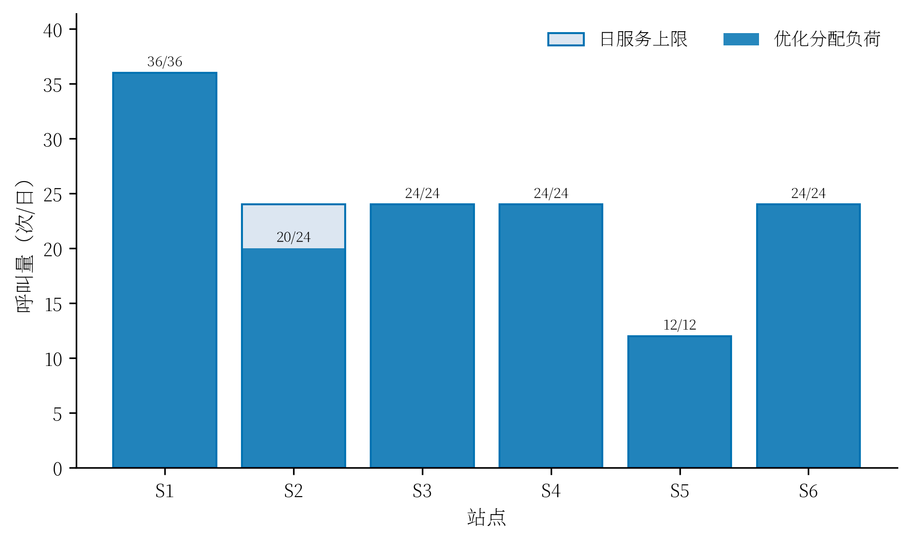{width=82%}

图3 各站停车上限、配车和分配负荷

表4给出非零服务分配。区域7由S2、S3、S4和S5共同承担，区域8由S4和S6承担，区域9由S1和S2承担，体现了容量约束下优先就近服务并允许跨站分流的运输结构。

表4 优化后的非零区域服务分配

| 区域 | 站点及分配量（次/日） | 区域需求 |
|:---:|---|---:|
| 1 | S1: 28 | 28 |
| 2 | S2: 15 | 15 |
| 3 | S3: 18 | 18 |
| 4 | S4: 10 | 10 |
| 5 | S5: 8 | 8 |
| 6 | S6: 6 | 6 |
| 7 | S2: 4；S3: 6；S4: 6；S5: 4 | 20 |
| 8 | S4: 4；S6: 18 | 22 |
| 9 | S1: 8；S2: 1 | 9 |
| 10 | S4: 4 | 4 |

求解器三阶段状态均正常，需求最大残差和容量最大超限均为0。主要距离指标为

$$
D^{\ast}=131.819720\ \mathrm{km\cdot 次/日},\qquad
\bar d=\frac{D^{\ast}}{140}=0.941569\ \mathrm{km}.
$$

若暂不考虑车辆忙碌与排队，静态响应下界为

$$
\bar T_{\mathrm{static}}=3+\frac{60\bar d}{45}=4.255426\ \mathrm{min}.
$$

该值是由长期平均距离推得的静态下界，与任务二基于逐呼叫仿真计算的平均响应时间含义不同。

### 5.7 覆盖率解释

实际运输分配中有121次/日位于3 km服务半径内，因此

$$
\rho_s=\frac{121}{140}=86.429\%.
$$

若只检查某区域3 km内是否存在站点，而忽略容量和实际分配，可覆盖136次/日，故潜在覆盖为97.143%。严格0.75 km中心代理覆盖只包含与六站坐标重合的区域1至6，共85次/日，即60.714%。图4集中比较三种口径。

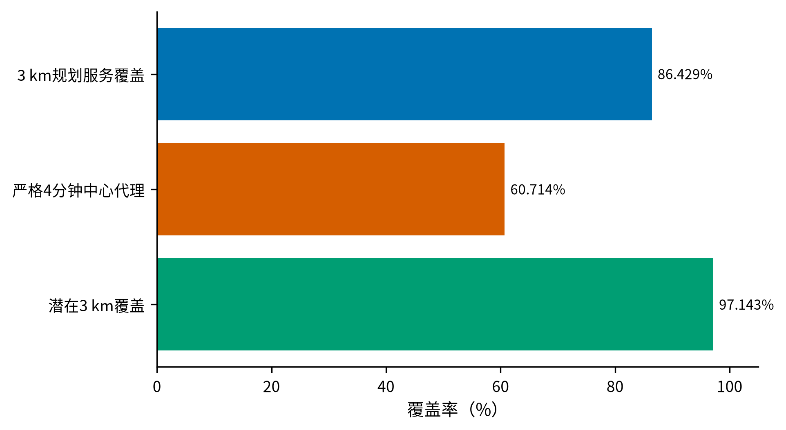{width=78%}

图4 三种覆盖口径的差异

任务一的最终方案为：启用全部6个站点，配车方案为$(3,2,2,2,1,2)$，并按表4进行长期服务分流。规划阶段的可执行3 km服务覆盖率为86.429%；计入准备时间后的严格中心代理覆盖率为60.714%，忽略站点容量时的空间潜在覆盖率为97.143%。后两项用于诊断空间覆盖条件，不替代任务二的逐呼叫实际响应率。

## 六、任务二：连续多日随机呼叫与车辆调度

### 6.1 给定日总量的条件NHPP

设$f(t)$为24 h周期密度，区域$i$参考强度为

$$
\lambda_i(t)=q_if(t\bmod24),\qquad
\int_0^{24}f(t)\,dt=1.
$$

为保持题目给定的140次/日需求规模，对每日总事件数施加条件$N_d=140$。给定事件数后，当天140个时刻独立服从$f(t)$，区域标签独立满足$P(I=i)=q_i/140$。区域日计数因此服从多项分布，期望仍为$q_i$。

定义周期高斯核

$$
G(t;\mu,\sigma)=\sum_{k\in\mathbb Z}
\exp\left[-\frac{(t-\mu+24k)^2}{2\sigma^2}\right],
$$

未归一化强度与归一化密度分别为

$$
g(t)=b+a_1G(t;\mu_1,\sigma_1)+a_2G(t;\mu_2,\sigma_2),
$$

$$
f(t)=\frac{g(t)}{\int_0^{24}g(s)\,ds}.
$$

采用$b=1$，$(a_1,\mu_1,\sigma_1)=(0.8,9,2)$，$(a_2,\mu_2,\sigma_2)=(1.0,18,2.5)$，形成上午与傍晚双峰。图5给出24 h密度与小时概率。该强度曲线用于描述缺少逐时数据条件下的日内变化情景，不属于历史数据拟合结果。

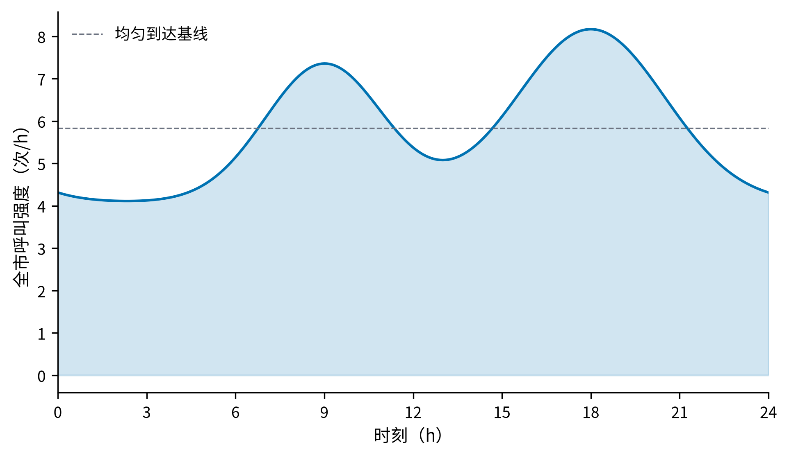{width=86%}

图5 周期双高斯条件NHPP日内强度

### 6.2 连续多日离散事件系统

12辆车固定归属六站。每辆车记录所属站、下一次可用时刻、当日已接受任务数及备用身份。离散事件仿真适合在静态常驻配置下同时刻画随机需求、车辆忙闲和排队过程^\[3\]^。呼叫按到达时间进入全市FCFS队列，只有队首拥有派车权。车辆在时刻$s_e$接受任务后，其响应时间为

$$
T_e^{\mathrm{resp}}=T_e^{\mathrm{wait}}+3+\frac{60d_{i(e),j(a)}}{45},
$$

并从$s_e$到$s_e+45$ min不可派。任务结束后回所属站。

同一时刻依次处理午夜计数切换、车辆任务完成、呼叫到达和FCFS派车。24:00只重置新日接受任务计数，车辆忙闲、剩余占用和队列全部继承。最后统计日24:00停止生成新呼叫后，继续处理已经到达的呼叫直至全部获得完整响应。

每个复制固定预热30天。预热期只删除指标，不重置车辆或队列；第30天遗留状态继续影响第31天。参数筛选采用3个复制、每个统计7天；最终评价采用30个新复制、每个统计30天。筛选种子和最终评价种子不重叠，同一复制中的A、B、C共享完全相同的呼叫流。

### 6.3 策略A：全局就近派车

对队首呼叫$e$，候选集$\mathcal A_e(t)$包含当前空闲且接受该任务后仍不超过当日12次上限的车辆。策略A选择

$$
a_A^{\ast}=\arg\min_{a\in\mathcal A_e(t)}d_{i(e),j(a)}.
$$

同距离时依次选择当日接单较少、站点编号较小、车辆编号较小的车辆。A允许跨站支援，但任务结束后车辆仍返回所属站点。

### 6.4 策略B：45 min前瞻保护性派车

候选车辆$a$对当前呼叫的无等待响应为

$$
T_{ea}^0=3+\frac{60d_{i(e),j(a)}}{45}.
$$

相对最近候选车的当前额外代价为

$$
\Delta T_{ea}=T_{ea}^0-\min_{b\in\mathcal A_e(t)}T_{eb}^0.
$$

仅保留$\Delta T_{ea}\le\delta$的车辆，防止为了未来覆盖而明显延误当前患者。设$S(t)$为当前车辆状态，$S^{(-a)}(t)$为派出车辆$a$后的反事实状态。若区域$r$在未来时刻$u$出现一条假想呼叫，预计最短响应为

$$
\widehat T_r(u\mid S)=\min_b\left[W_b(u\mid S)+3+\frac{60d_{r,j(b)}}{45}\right],
$$

其中$W_b$同时考虑车辆已有任务和日12次限制。派出$a$造成的未来45 min期望累计响应损失为

$$
C_a(t)=\int_t^{t+0.75}\sum_{r=1}^{10}\lambda_r(u)
\left[\widehat T_r(u\mid S^{(-a)})-\widehat T_r(u\mid S)\right]du.
$$

再以

$$
B_a(t)=\frac{n_{a,d}+1}{12}
$$

惩罚过早耗尽某辆车的日接单额度，最终评分为

$$
J_{ea}=\Delta T_{ea}+C_a(t)+\beta B_a(t).
$$

三个分量均换算为min。策略B在合法候选中选择$J_{ea}$最小的车辆。粗网格搜索$\beta\in\{0,0.5,1,2,4\}$和$\delta\in\{0.5,1,1.5,2\}$，再在优胜区域细化，最终选取$(\beta,\delta)=(4,2)$。图6显示筛选过程。

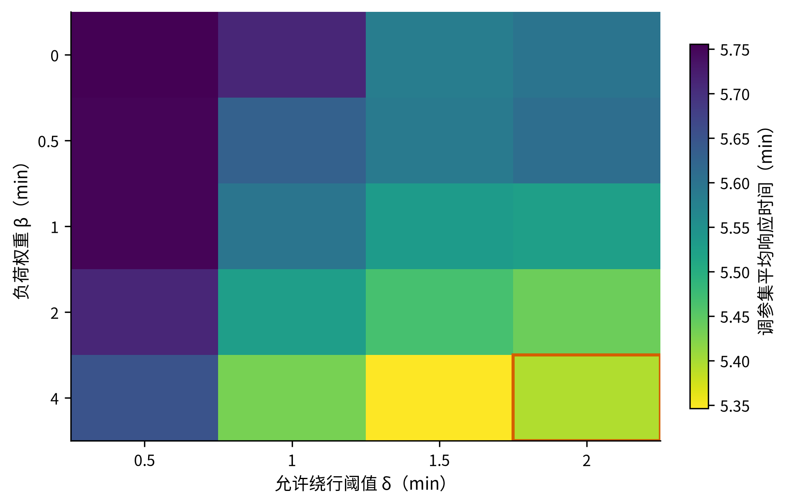{width=82%}

图6 策略B参数筛选结果

### 6.5 策略C：固定备用车辆配置

设站点$j$固定备用车辆数为$r_j$。每站至少保留一辆常规车，故

$$
0\le r_j\le u_j-1,\qquad u=(3,2,2,2,1,2).
$$

除全零向量外有47种非零备用向量，释放阈值枚举$\tau\in\{4,5,6,7,8\}$ min，共筛选235个候选。对队首呼叫，先计算最快常规车从呼叫到达起的预计响应$\widehat T_e^{\mathrm{reg}}$。只有同时满足

$$
\widehat T_e^{\mathrm{reg}}>\tau
$$

且当前合法空闲备用车的实际响应严格更短时，才解除备用保护；完成任务回站后自动恢复备用身份。

候选筛选结果见图7，其中每一点代表一个备用向量与阈值组合，横轴为相对A的平均响应差，纵轴为严格4 min率，零差虚线表示与A平均响应相同。绿色标记为最终进入样本外评价的候选。筛选得到

$$
r^{\ast}=(0,0,1,0,0,0),\qquad \tau^{\ast}=7\ \mathrm{min},
$$

即S3的两辆车中固定一辆承担备用角色。全部235个候选配置基于3个独立复制进行筛选，因此该结果的最优性限于所设筛选样本，后续再通过独立样本评价其运行表现。

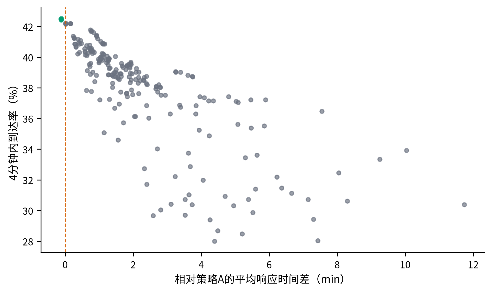{width=84%}

图7 策略C的235个备用配置候选筛选

### 6.6 评价指标与统计方法

主指标为平均响应时间。以4 min为起罚点，延迟惩罚成本定义为

$$
C_e=200\max(T_e^{\mathrm{resp}}-4,0)\quad\mathrm{(元)}.
$$

辅助指标包括严格4 min率、P90/P95、平均等待、等待概率、最大队列、日末积压和区域平均响应极差。每个指标先在独立复制内计算，再对30个复制求均值及95% t置信区间。策略比较使用共同随机数成对差，例如

$$
\Delta_m^{B-A}=M_{B,m}-M_{A,m}.
$$

最近医院距离$h_i$不进入派车评分。若把它加入任务一目标，新增项$\sum_iq_ih_i$由需求守恒固定，不能改变最优分配。本文仅补充理想行驶链条

$$
T_e^{\mathrm{chain}}=T_e^{\mathrm{resp}}+\frac{60h_{i(e)}}{45},
$$

但不把它解释为包含现场处置、交接与院内救治的真实到院时间。

### 6.7 算法设计

任务二采用连续多日离散事件仿真，在共同呼叫流下完成参数筛选和策略比较。

表5 任务二算法步骤

| 步骤 | 具体内容 |
|:---:|---|
| Step 1：生成条件NHPP呼叫流 | 每个仿真日固定生成140次呼叫，依据周期双高斯密度抽取到达时刻，并按$q_i/140$抽取区域标记。 |
| Step 2：初始化并预热系统 | 按任务一配车方案建立12辆车的所属站、可用时刻、日接单计数和备用身份，连续运行30天预热并保留跨午夜状态。 |
| Step 3：推进离散事件 | 按时间顺序处理日界切换、车辆任务完成、呼叫到达和FCFS派车；忙车、队列及未完成任务跨日继承。 |
| Step 4：执行候选派车规则 | 筛选满足空闲和日12次上限的车辆；A按距离选择，B最小化$J_{ea}$，C按阈值决定是否释放固定备用车。 |
| Step 5：筛选策略参数 | 使用独立种子搜索策略B的$(\beta,\delta)$和策略C的$(r,\tau)$，依据平均响应时间及严格4 min响应率确定候选方案。 |
| Step 6：开展样本外评价 | 在30个新复制中令A、B、C共享呼叫流，统计响应、等待、队列、公平性和延迟成本，并计算成对差的95%置信区间。 |
| Step 7：核验运行约束 | 检查呼叫量、唯一派车、单车日接单上限、任务不重叠、FCFS顺序和跨午夜状态连续性，输出最终调度方案。 |

### 6.8 最终结果与方案选择

30个样本外复制的主要结果见表6；每个复制在30天预热后统计30天，共4200次呼叫。

表6 三种调度策略的样本外评价

| 指标 | A：全局就近 | B：前瞻保护 | C：固定备用 |
|---|---:|---:|---:|
| 平均响应/min | 5.6142 [5.5577, 5.6708] | **5.3432 [5.3111, 5.3753]** | 5.5872 [5.5400, 5.6343] |
| 严格4 min率/% | 43.13 | **44.92** | 42.94 |
| P95响应/min | 10.9949 | **9.9006** | 10.8021 |
| 平均等待/min | 0.4053 | **0.2225** | 0.3657 |
| 等待概率/% | 3.51 | **2.47** | 3.32 |
| 最大队列/次 | 5.4333 | **4.7333** | 5.4667 |
| 区域均值极差/min | 4.1578 | **3.9994** | 4.0822 |
| 平均每次延迟成本/元 | 409.08 | **358.44** | 403.27 |
| 日均延迟成本/元 | 57271.05 | **50181.83** | 56458.12 |

B相对A平均响应减少0.2711 min，成对95%置信区间为$[-0.3116,-0.2305]$ min；C相对A减少0.0271 min，区间为$[-0.0487,-0.0055]$ min。图8显示B相对A在平均响应、P95、等待和延迟成本上的方向一致改善；图9给出B、C相对A的成对响应差与95%区间。

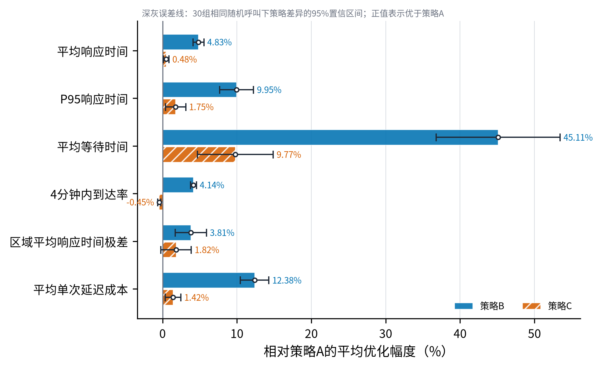{width=82%}

图8 策略B相对A的多指标变化

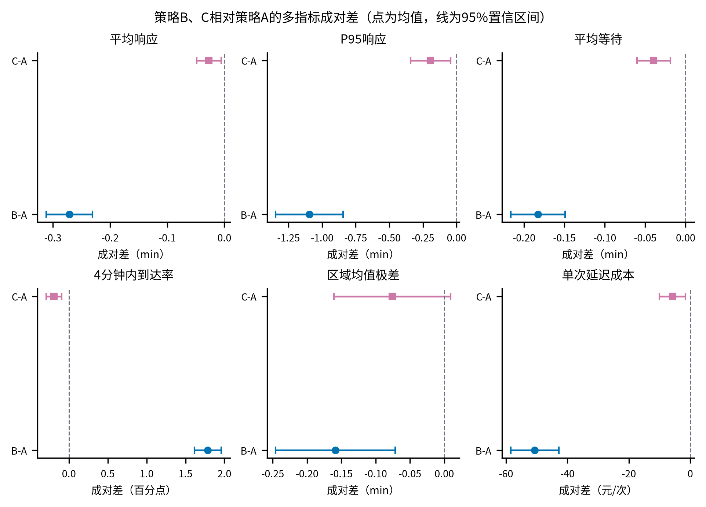{width=78%}

图9 共同随机数下B、C相对A的成对响应差

策略B使平均响应时间降低4.83%，P95降低9.95%，平均等待时间降低45.11%，平均每次延迟成本降低50.64元，日均延迟总成本降低7089.22元，并减小区域平均响应时间极差，因而选作日常主方案。利用仿真比较时空随机需求下的车辆配置与调度规则，符合现有救护车仿真优化研究的建模范式^\[4\]^；本文的输入、约束与数值均按本题条件设定。策略C在S3配置1辆固定备用车，其平均响应时间与策略A相近，但严格4 min响应率略低于A，综合性能弱于B，因此作为备用保障方案，不替代日常主方案。

最终可执行规则汇总于表7。

表7 任务二最终调度方案

| 运行场景 | 采用规则 | 关键参数 | 执行说明 |
|---|---|---|---|
| 日常主运行 | 策略B | $\beta=4$ min，$\delta=2$ min | 在当前额外响应不超过2 min的候选中最小化45 min前瞻评分 |
| 显式备用保障 | 策略C | S3固定1辆备用，$\tau=7$ min | 常规车预计响应超过7 min且备用车更快时解除保护 |
| 无优化基准 | 策略A | 无 | 全市合法车辆中选择最近者，用于效果比较 |

### 6.9 约束与复现核验

程序逐复制检查：每日恰生成140次呼叫；每个呼叫最终且仅派车一次；每车每日接受任务不超过12次；同一车辆任务区间不重叠；后到呼叫不越过队首；车辆恰在接受任务45 min后恢复；跨午夜忙车与队列连续继承。任务一求解状态正常，需求残差和容量超限为0。任务二的30个最终复制中，每个策略均有30行复制结果，种子为400000至400029，每行包含4200次测量呼叫。

三项任务的结果与约束可使用以下命令复核：

`python src/reproduce_all.py --project-root . --mode verify --scope all`

该入口重新计算任务一可行性与运输分配校验，复核任务二汇总，并从任务三复制级结果重建逐时长表与连续响应面。当前全套回归测试与3项子测试均已通过；复现清单绑定18项输入和结果文件。

## 七、任务三：连续事故时长下的动态应急响应

### 7.1 事故需求与最不利窗口

事故区域$k$遍历全部10个需求区，持续时间为连续变量

$$
H\in[0.5,12]\ \mathrm{h}.
$$

事故期间区域$k$的总强度升至正常值5倍。为保持任务二日常背景呼叫不变，在其上叠加独立NHPP增量

$$
\lambda_k^{\mathrm{extra}}(t)=4q_kf(t\bmod24),
\qquad t\in[t_0,t_0+H),
$$

其他区域不增加强度。对每个合法$H$，事故起点定义为周期日内强度在长度$H$窗口中的积分最大点：

$$
t^{\ast}(H)=\underset{t_0\in[0,24)}{\arg\max}
\int_{t_0}^{t_0+H}f(t\bmod24)\,dt.
$$

程序以1 min网格搜索$t^{\ast}(H)$，该网格只是数值求积与寻优工具。事故期预期新增呼叫量为

$$
E[N_k^{\mathrm{extra}}(H)]
=4q_k\int_{t^{\ast}(H)}^{t^{\ast}(H)+H}f(t\bmod24)\,dt.
$$

如图10所示，连续函数与实际仿真节点被同时展示。R1因日均需求最大，在相同持续时间下产生最高新增呼叫压力；采样点只表示随机仿真设计，不把$H$离散化。

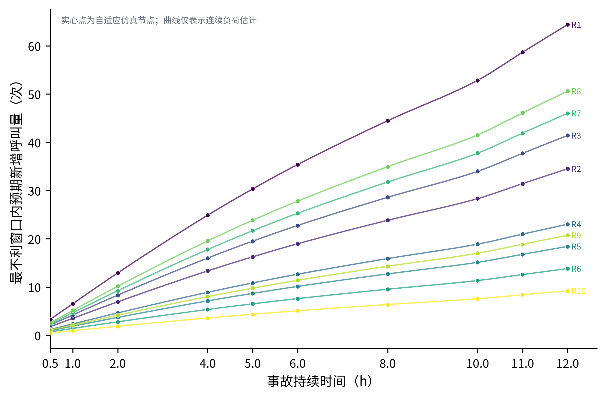{width=84%}

图10 连续事故持续时间下的预期新增呼叫与自适应节点

### 7.2 常态预测与事故感知预测

以任务二日常主策略B为基线，并使用共同随机数比较两个模式：

- $B_N$：实际呼叫流包含事故增量，但45 min前瞻损失仍按日常强度计算；
- $B_E$：只在事故已经发生的时段内，把已识别事故区的前瞻强度乘子改为5，其余评分、约束和参数保持不变。

因此$B_E$在时刻$t$对候选车辆$a$仍计算

$$
J_{ea}^{E}=\Delta T_{ea}+C_a^{E}(t)+\beta B_a(t),
\qquad \Delta T_{ea}\le\delta,
$$

其中$(\beta,\delta)=(4,2)$，$C_a^{E}(t)$只在未来窗口与事故区间重叠时使用5倍强度。两个模式均执行FCFS、45 min占用、日12次上限、任务后回所属站，不增加车辆或外援；$B_E$也不叠加策略C的固定备用身份。这样比较的正是“已知事故后修改需求预测”本身的边际作用。

### 7.3 事故期评价边界

每个复制先执行固定30天预热。只统计到达时刻位于$[t_0,t_0+H)$的呼叫；事故结束时仍在等待的呼叫继续仿真到获得派车，其完整响应仍计入。事故后的新呼叫不进入任务三指标，也不把事故结束积压扩展成恢复阶段评价。

对每个区域和模式报告平均响应、P95、严格4 min率及最大事故队列，记为

$$
\bar T_k(H),\quad P95_k(H),\quad C_{4,k}(H),\quad Q_{\max,k}(H).
$$

对同一呼叫流的成对差使用$B_E-B_N$；响应时间差为负表示事故感知模式改善。图11展示全部10个事故区域的平均响应曲面及置信带宽诊断，表明区域与持续时间共同决定压力，且长时事故处的不确定性明显增大。

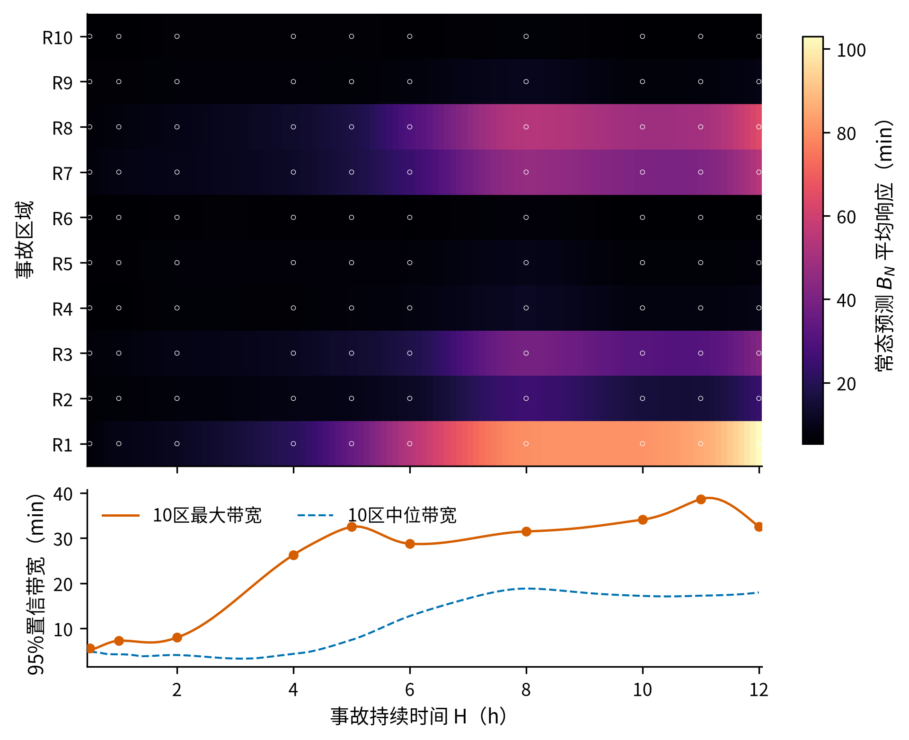{width=88%}

图11 各事故区域的连续响应面与不确定性

### 7.4 自适应节点与PCHIP响应面

连续区间无法通过有限计算逐点仿真。本文从$0.5,1,2,4,8,12$ h六个初始节点出发，对平均响应、P95、严格4 min率和最大事故队列的$B_N$、$B_E$及成对差曲线进行无量纲化，再依据区间端点的最大95%置信半宽和相邻斜率变化选择中点。两轮补点结果见表8。

表8 任务三自适应持续时间节点

| 轮次 | 新增时长/h | 搜索区间/h | 选择依据 | 获取得分 |
|:---:|---:|:---:|:---:|---:|
| 1 | 6 | [4, 8] | 高不确定性 | 1.3987 |
| 1 | 10 | [8, 12] | 高不确定性 | 1.7621 |
| 2 | 5 | [4, 6] | 高不确定性 | 0.3649 |
| 2 | 11 | [10, 12] | 高不确定性 | 1.7621 |

最终节点集合为

$$
\mathcal H=\{0.5,1,2,4,5,6,8,10,11,12\}\ \mathrm{h}.
$$

每个节点遍历10个事故区、10个随机种子和两种成对模式，共得到2000行复制结果。对每个事故区、模式、指标和种子分别在$\mathcal H$上构造保形分段三次Hermite插值$\widehat M_{k,s}(H)$，再在任意评价位置跨复制计算均值和t型95%置信带：

$$
\bar M_k(H)=\frac{1}{n}\sum_{s=1}^{n}\widehat M_{k,s}(H),
$$

$$
CI_{95}(H)=\bar M_k(H)\pm
t_{0.975,n-1}\frac{s_M(H)}{\sqrt n}.
$$

对各复制分别插值后再作跨复制汇总，以保留随机重复结构。PCHIP用于构造有限节点间的保形数值近似，不代表精确连续解。图12给出R6、R2、R1三个低、中、高压力代表区域的曲线。

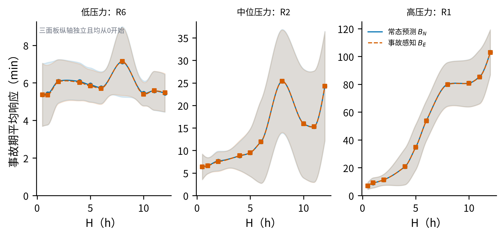{width=84%}

图12 低、中、高压力事故区域的平均响应曲线

### 7.5 算法设计

任务三采用“最不利窗口搜索—自适应仿真—复制级响应面”的连续事故时长分析流程。

表9 任务三算法步骤

| 步骤 | 具体内容 |
|:---:|---|
| Step 1：确定事故情景 | 遍历10个事故区域，令$H\in[0.5,12]$ h；事故期叠加4倍日常强度，使事故区总强度达到正常值的5倍。 |
| Step 2：搜索最不利起点 | 对给定$H$在24 h周期上按1 min网格计算强度积分，取积分最大的窗口起点$t^{\ast}(H)$。 |
| Step 3：构造共同随机呼叫流 | 完成30天预热后生成日常与事故增量呼叫，使$B_N$和$B_E$在同一区域、时长和种子下共享事件流。 |
| Step 4：执行两种预测模式 | $B_N$沿用日常强度计算45 min前瞻损失；$B_E$在已识别事故区和事故时段内将预测强度乘子调整为5。 |
| Step 5：自适应补充时长节点 | 从6个初始节点出发，依据95%置信半宽和相邻斜率变化选择区间中点，经两轮补点得到10个仿真节点。 |
| Step 6：构造连续响应面 | 对每个区域、策略、指标和随机种子在节点集上建立PCHIP插值，再跨复制计算均值与95%置信带。 |
| Step 7：评价应急效果 | 汇总全市、事故区和非事故区的平均响应、P95、严格4 min响应率与最大队列，计算成对差并识别失效边界。 |

### 7.6 全市响应与事故感知效应

在每个$H$和种子内，先等权平均完整10个事故区域情景，再计算$B_E-B_N$成对差。表10给出节点结果。

表10 全市逐时长平均响应与成对效应

| $H$/h | $B_N$/min | $B_E$/min | $B_E-B_N$/min | 95%置信区间/min |
|---:|---:|---:|---:|:---:|
| 0.5 | 6.1706 | 6.1600 | -0.0107 | [-0.0541, 0.0328] |
| 1 | 6.7916 | 6.8050 | 0.0135 | [-0.0185, 0.0454] |
| 2 | 7.9594 | 7.9369 | -0.0226 | [-0.0535, 0.0084] |
| 4 | 9.8666 | 9.8930 | 0.0264 | [-0.0435, 0.0963] |
| 5 | 12.3799 | 12.3419 | -0.0380 | [-0.0857, 0.0097] |
| 6 | 16.9489 | 16.9687 | 0.0198 | [-0.0260, 0.0656] |
| 8 | 28.6680 | 28.6031 | -0.0649 | [-0.1318, 0.0020] |
| 10 | 24.4728 | 24.4155 | -0.0572 | [-0.1221, 0.0077] |
| 11 | 25.0225 | 24.9244 | -0.0981 | [-0.1969, 0.0007] |
| 12 | 31.6386 | 31.5920 | -0.0466 | [-0.1142, 0.0210] |

$B_N$全市平均响应由0.5 h时的6.1706 min总体升至12 h时的31.6386 min。8 h节点高于10 h和11 h并不意味着延长事故能改善响应：不同$H$对应不同最不利起点，且随机拥堵与队列状态不同，不能把有限节点的局部波动解释为确定性单调规律。10个节点的全市平均差在$[-0.0981,0.0264]$ min内，所有95%区间均跨0，因此证据不支持“$B_E$显著改善全市均值”。

为考察局部保护，在固定$H$、种子和模式内汇总10个事故情景中的全部事故区呼叫或非事故区呼叫，按呼叫数加权后再成对比较。零呼叫情景保留为零权重，同时强制检查10区齐全和两策略呼叫数一致。分域节点结果见表11，负值表示$B_E$改善。

表11 事故区与非事故区平均响应的成对效应

| $H$/h | 事故区差/min | 事故区95%CI/min | 非事故区差/min | 非事故区95%CI/min |
|---:|---:|:---:|---:|:---:|
| 0.5 | -0.0213 | [-0.1654, 0.1229] | 0.0181 | [-0.0540, 0.0902] |
| 1 | -0.0175 | [-0.1072, 0.0722] | 0.0362 | [0.0016, 0.0708] |
| 2 | -0.0520 | [-0.1119, 0.0080] | -0.0088 | [-0.0384, 0.0208] |
| 4 | -0.0219 | [-0.0830, 0.0392] | 0.0653 | [-0.0198, 0.1503] |
| 5 | -0.0997 | [-0.2376, 0.0381] | -0.0112 | [-0.0308, 0.0085] |
| 6 | -0.0265 | [-0.0906, 0.0377] | 0.0334 | [-0.0025, 0.0693] |
| 8 | **-0.1519** | **[-0.2866, -0.0173]** | -0.0094 | [-0.0557, 0.0369] |
| 10 | **-0.0941** | **[-0.1860, -0.0021]** | -0.0309 | [-0.0877, 0.0258] |
| 11 | **-0.1965** | **[-0.3523, -0.0407]** | -0.0380 | [-0.1286, 0.0526] |
| 12 | -0.0604 | [-0.1249, 0.0042] | -0.0525 | [-0.1595, 0.0544] |

事故区在$H=8,10,11$ h分别改善0.1519、0.0941、0.1965 min，对应区间均低于0；其余时长证据不足。非事故区仅$H=1$ h出现0.0362 min的小幅恶化且区间高于0，其他节点区间均跨0。图13用成对差和置信区间集中展示这一结果。

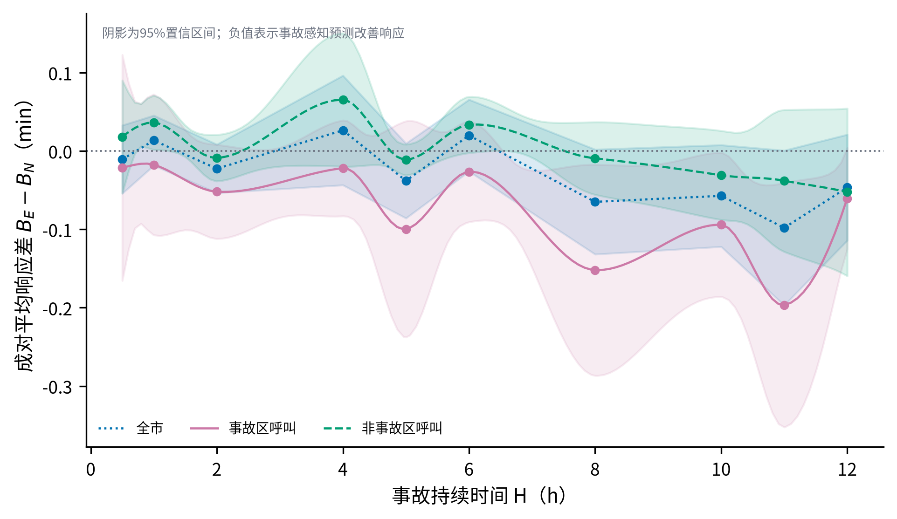{width=84%}

图13 事故感知模式对事故区与非事故区的成对效应

R1是最高压力区域，R6、R2、R1分别作为低、中、高压力代表。总体上，事故区域和持续时间引起的容量压力明显大于调整45 min需求预测带来的收益；$B_E$主要改善事故识别后的局部车辆保护，无法在固定车队条件下消除系统超载。若需显著降低长时事故的响应时间，应进一步引入增车、临时站或外援等扩容决策，这些资源不在本题约束范围内。题目未给出$H$的概率分布，因此不将各节点等权合成为与持续时间无关的总体指标。

## 八、模型评价

### 8.1 模型优点

第一，容量分析确定唯一可行配车后，运输规划进一步优化服务分配，区分了可行性结论与优化结果。第二，词典序目标分别处理距离和覆盖，避免对不同量纲指标直接加权。第三，任务二纳入30天预热、跨午夜状态、日接单上限和共同随机数，平均响应时间由逐呼叫仿真计算。第四，策略B与固定备用策略C分别建模，兼顾日常派车优化与备用车辆配置要求。第五，任务三区分连续事故时长与有限仿真节点，并基于复制级PCHIP构造置信带，明确了响应面的数值近似性质。第六，分域效应按10个事故区域情景中的实际呼叫数加权，无呼叫情景以零权重保留，从而保持统计口径一致。

### 8.2 模型局限

区域中心仅表示聚合需求，无法刻画区内真实呼叫位置；欧氏距离未包含道路拓扑、拥堵和信号灯影响。双高斯强度为日内变化的情景设定，结论的适用范围受其参数限制。单次任务按固定45 min完整占用处理，未考虑任务时长差异。固定备用方案由有限复制筛选得到，其最优性限于所设样本。任务三假定事故开始时即可识别且强度升至日常值的5倍，未考虑识别滞后、伤情分级和持续时间分布；PCHIP响应面是10个节点间的数值近似。10个事故区域情景用于遍历空间差异，不表示各区域具有相同的事故发生概率。

### 8.3 推广方向

若获得逐条历史呼叫、路网行程时间和任务持续时间数据，可分别拟合分区时变强度、以路网行程距离替换欧氏距离，并建立随机占用时间分布。在保持模型结构不变的条件下，运输规划可接入路网距离，离散事件仿真可接入实测到达过程。进一步获得事故识别时间和持续时间分布后，可将条件响应面用于贝叶斯更新或滚动风险评价；若允许新增车辆、临时站点或外援，还可在任务三上层增加资源扩容决策。

## 参考文献

[1] Matteson D S, McLean M W, Woodard D B, Henderson S G. Forecasting emergency medical service call arrival rates[J]. The Annals of Applied Statistics, 2011, 5(2B). DOI: 10.1214/10-AOAS442.

[2] Jánošíková Ľ, Jankovič P, Kvet M, Zajacová F. Coverage versus response time objectives in ambulance location[J]. International Journal of Health Geographics, 2021, 20: 32. DOI: 10.1186/s12942-021-00285-x.

[3] Wu C H, Hwang K P. Using a discrete-event simulation to balance ambulance availability and demand in static deployment systems[J]. Academic Emergency Medicine, 2009, 16(12): 1359-1366. DOI: 10.1111/j.1553-2712.2009.00583.x.

[4] Yang W, Su Q, Huang S H, Wang Q, Zhu Y, Zhou M. Simulation modeling and optimization for ambulance allocation considering spatiotemporal stochastic demand[J]. Journal of Management Science and Engineering, 2019, 4(4): 252-265. DOI: 10.1016/j.jmse.2020.01.004.

## 附录A 复现与证据文件

三问权威结果分别位于`results/task-1/`、`results/task-2/`和`results/task-3/`。`results/复现清单.json`以SHA-256绑定原题及18项关键证据；只读核验命令为`python src/reproduce_all.py --project-root . --mode verify --scope all`。图1至图13均由`src/generate_figures.py`基于上述结果生成。
