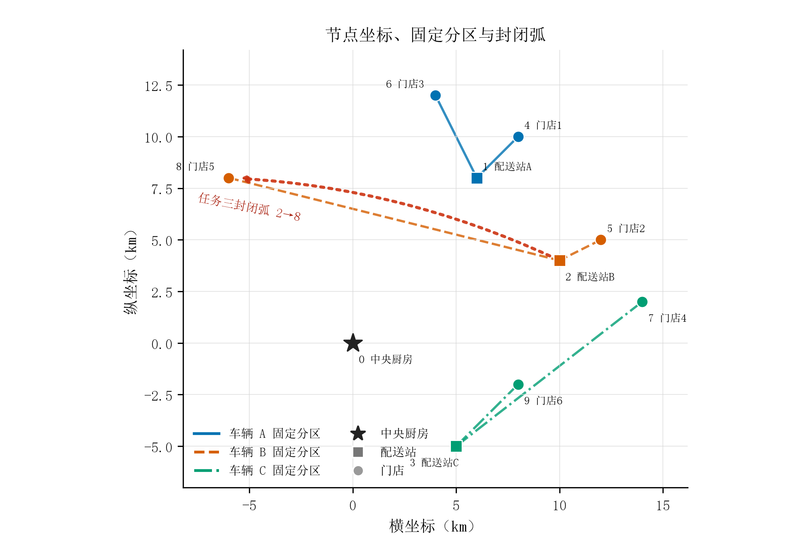
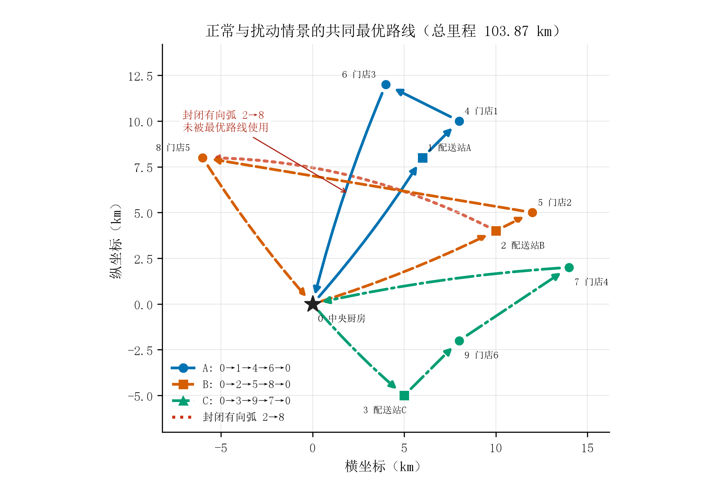

# 固定分区与严格保鲜优先下的冷链配送路径优化

## 摘 要

针对一个中央厨房、3 个区域配送站和 6 家门店组成的冷链配送网络，本文建立固定分区、配送站必经的路线型 0-1 车辆路径模型。每条候选路线预先递推到达与服务时刻，并据此形成里程、早到、迟到和封路可行性系数；路线选择变量再把这些系数联结为实际方案。三辆车均于 4:30 发车并返厨；目标按词典序先最小化迟到门店数，再最小化运输成本与时间窗事件罚。固定分区后完整方案仅有 $2^3=8$ 种，逐一计算即可得到当前模型下的精确最优解。

正常场景的 A、B、C 车路线分别为 $0\to1\to4\to6\to0$、$0\to2\to5\to8\to0$、$0\to3\to9\to7\to0$；总里程为 103.8713 km，综合成本为 $415.4852$ 元，6 家门店均按时到达。任务三严格禁用有向弧 $2\to8$，但正常最优路线未使用该弧；重优化后路线和成本不变，增量为 0。统一门店服务时长不超过 $21.4205$ 分钟/店时，该零增量结论保持成立。模型使用欧氏距离、恒定车速和发车前静态重优化，实际应用时需以道路行程时间和真实装卸时长重新标定。

**关键词：** 冷链配送；车辆路径问题；时间窗；词典序优化；精确枚举；扰动重优化

## 一、问题重述

某连锁餐饮企业由中央厨房统一组织生鲜食材配送。配送网络包含中央厨房、A/B/C 三个区域配送站和 6 家门店，每个配送站按历史业务关系负责两家门店。题目给出各节点坐标、门店需求与时间窗，以及车辆速度、单位里程成本、时间窗事件罚、最大载货量和最大行驶里程。

任务一要求分析冷链配送的容量、里程、站点前序和时间窗等约束，建立综合成本最小的多约束 VRPTW。任务二要求确定正常场景下各车的路线、停靠顺序、门店到达时刻和总成本。任务三要求在有向路段 $2\to8$ 封闭后重新规划，并以相同口径量化路线和成本变化。

## 二、问题分析

### 2.1 路径结构

车辆路径问题以满足客户需求并降低车队行驶代价为基本目标 [1]，加入客户时间窗后，路径顺序与到达时刻必须联合确定 [2,5]。本题另有两层业务结构：车辆从中央厨房统一发车，门店又分别归属于 A/B/C 配送站。本文据此采用三车固定分区合同：每辆车先访问所属配送站，再访问该站负责的两家门店，最后返回中央厨房；需求不可拆分，车辆不可跨区服务。

各区域总需求分别为 27、32、36 箱，均小于单车容量 60 箱。固定分区后，每辆车只需决定两家门店的先后顺序，因此可以用候选路线变量表达原 VRPTW，在不损失当前可行解的前提下把组合数降为 8。

若沿用一般 VRPTW 的逐弧变量，需要同时处理弧选择、流平衡、时间递推和大常数联结；但在本题已固定“中央厨房—配送站—两家门店—中央厨房”的结构后，每辆车的全部许可路径只有两种门店排列。路线型模型直接把一条完整许可路线作为选择对象，既保留容量、前序、返厨和时间窗含义，又避免为 8 个组合引入不必要的大常数约束。其精确性来自候选集完整覆盖所有许可排列，而不是通过删去困难约束换取简化。

### 2.2 时间窗口径

题目一方面称门店时间窗严格，迟到会使食材报废，另一方面又给出早到和迟到事件罚。硬窗、软窗和有限放宽时间窗具有不同的可行域与成本含义 [4]。若直接把两项罚金与里程费加权求和，80 元的一次迟到可能被较短路线抵消，这与保鲜要求冲突。本文先最小化迟到门店数；只有迟到数已经最小时，才比较运输成本和事件罚。该词典序口径使零迟到方案优先于任何迟到方案，同时保留题给成本参数。

早到按车辆实际到达时刻早于窗口起点计一次。车辆可以等待至窗口开启后再服务，但等待不撤销已经发生的早到事件。迟到按实际到达时刻晚于窗口终点计一次。若存在零迟到解，迟到罚为 0；仅当所有方案均有迟到时，才报告包含迟到罚的软窗应急解。

### 2.3 施工扰动

题目将施工路段明确写为有向弧 $2\to8$。因此任务三应先检查正常最优路线是否使用该弧，再在禁弧后的同一可行域上重优化。不能为了得到非零绕路成本而把封闭方向改为 $8\to2$，也不能强制正常方案先使用 $2\to8$。由于题目未给封路发现时刻和车辆实时位置，本文按 4:30 发车前已知施工信息进行静态重优化。节点空间关系、固定分区和封闭方向见图 1。

{width=84%}

图 1 节点坐标、固定分区与任务三封闭弧

### 2.4 数据整理与约束尺度

建模所用节点数据见表 1。节点 0 为中央厨房，节点 1—3 为配送站，节点 4—9 为门店。门店归属把一般多车路径问题分解为三个两点排序子问题；坐标单位为 km，因此欧氏距离可直接作为当前缺少道路矩阵时的距离代理。

表 1 节点、需求与时间窗数据

| 节点 | 类型 | 坐标/km | 需求/箱 | 时间窗 | 归属或作用 |
|:---:|---|:---:|---:|:---:|---|
| 0 | 中央厨房 | $(0,0)$ | — | 04:30 发车 | 统一起终点 |
| 1 | 配送站 A | $(6,8)$ | — | — | 服务门店 1、3 |
| 2 | 配送站 B | $(10,4)$ | — | — | 服务门店 2、5 |
| 3 | 配送站 C | $(5,-5)$ | — | — | 服务门店 4、6 |
| 4 | 门店 1 | $(8,10)$ | 15 | 04:30–05:30 | A 区 |
| 5 | 门店 2 | $(12,5)$ | 18 | 04:45–05:45 | B 区 |
| 6 | 门店 3 | $(4,12)$ | 12 | 04:30–05:30 | A 区 |
| 7 | 门店 4 | $(14,2)$ | 20 | 04:45–05:45 | C 区 |
| 8 | 门店 5 | $(-6,8)$ | 14 | 04:45–05:45 | B 区 |
| 9 | 门店 6 | $(8,-2)$ | 16 | 04:30–05:30 | C 区 |

## 三、模型假设

1. 三辆同质冷链车均于 4:30 从中央厨房出发，分别绑定配送站 A、B、C；车辆先到所属配送站，再服务该站的两家门店并返回中央厨房。
2. 门店需求不可拆分且不可跨区域配送，单车路线的 180 km 上限包含返程。
3. 节点间以坐标欧氏距离作为道路距离代理，车辆全程以 35 km/h 匀速行驶，不考虑拥堵和方向差异。
4. 题目未提供卸货时长，基线取门店服务时长为 0；其影响通过统一服务时长阈值单独评价。
5. 车辆到达门店后若早于窗口起点，可以等待；早到、迟到均按到达事件而非偏离分钟数计罚。
6. 车辆运输温度始终不高于 -18 ℃，从而满足门店不高于 -15 ℃ 的要求。由于缺少温度变化和制冷能耗数据，不另建热力学成本模型。
7. 任务三仅禁用有向弧 $2\to8$，并按发车前已知封路处理。

这些假设影响不同层面的结论：固定分区和站点必经限定了可行域，因此“全局最优”只对该合同成立；欧氏距离与恒速决定路线和时刻的数值，真实道路矩阵可能改变排序；零服务时长只影响后续门店到达时刻，故需用阈值分析界定其适用范围；恒温假设只能证明题给温度门槛可行，不能推出制冷能耗；发车前已知封路则把任务三限定为静态重优化，不能代表在途车辆的动态改道。

## 四、符号说明

主要符号与单位见表 2。

表 2 符号说明

| 符号 | 含义 | 单位 |
|:---:|---|:---:|
| $K$ | 车辆集合，$K=\{A,B,C\}$ | — |
| $s_k$ | 车辆 $k$ 对应的配送站 | — |
| $C_k$ | 车辆 $k$ 负责的两家门店集合 | — |
| $R_k$ | 车辆 $k$ 的候选闭合路线集合 | — |
| $v_{krh}$ | 路线 $r$ 的第 $h$ 个节点 | — |
| $z_{kr}$ | 车辆 $k$ 是否选择路线 $r$ | 0/1 |
| $q_i$ | 门店 $i$ 的配送需求 | 箱 |
| $d_{ij}$ | 节点 $i$ 至 $j$ 的欧氏距离 | km |
| $\tau_{ij}$ | 节点 $i$ 至 $j$ 的行驶时间 | min |
| $[a_i,b_i]$ | 门店 $i$ 的允许到达时间窗 | min |
| $\bar A_{krh},\bar T_{krh}$ | 路线级到达、开始服务时刻 | min |
| $\bar e_{krh},\bar\ell_{krh}$ | 路线级早到、迟到系数 | 0/1 |
| $D_{kr},Q_{kr}$ | 候选路线的里程与载货量 | km，箱 |
| $g_{kr}^{\omega}$ | 路线是否经过情景 $\omega$ 的封闭弧 | 0/1 |
| $A_i^{\omega},T_i^{\omega}$ | 选中方案到达门店 $i$、开始服务的时刻 | min |
| $E_i^{\omega},H_i^{\omega}$ | 选中方案的早到、迟到指标 | 0/1 |
| $D(P)$ | 完整方案 $P$ 的总里程 | km |
| $L(P)$ | 完整方案 $P$ 的迟到门店数 | 个 |
| $C(P)$ | 运输费与时间窗事件罚之和 | 元 |

## 五、任务一：固定分区 VRPTW 模型

### 5.1 候选路线与路线级时刻

节点 $i,j$ 的坐标分别为 $(x_i,y_i)$、$(x_j,y_j)$。距离和行驶时间为

$$
d_{ij}=\sqrt{(x_i-x_j)^2+(y_i-y_j)^2},\qquad
\tau_{ij}=\frac{60d_{ij}}{35}.
$$

车辆 $k$ 对应配送站 $s_k$ 和门店集合 $C_k=\{i_k,j_k\}$。站点必经、固定分区和闭合路线使候选集恰为

$$
R_k=\{(0,s_k,i_k,j_k,0),(0,s_k,j_k,i_k,0)\}.
$$

把路线 $r$ 写为节点序列 $(v_{kr0},\ldots,v_{kr4})$。路线级时刻是由路线顺序确定的系数，而不是与路线选择相互独立的自由变量。车辆初始离开时刻为 $t_0=270$ min，令 $\bar T_{kr0}=270$，并对 $h=0,\ldots,3$ 递推

$$
\bar A_{kr,h+1}=\bar T_{krh}+s_{v_{krh}}+\tau_{v_{krh},v_{kr,h+1}},
$$

若下一节点是门店，则等待至时间窗开启后服务：

$$
\bar T_{kr,h+1}=\max(\bar A_{kr,h+1},a_{v_{kr,h+1}}),
\qquad v_{kr,h+1}\in C_k.
$$

若下一节点是配送站或中央厨房，则不存在门店时间窗：

$$
\bar T_{kr,h+1}=\bar A_{kr,h+1},
\qquad v_{kr,h+1}\notin C_k.
$$

其中门店服务时长基线为 0，配送站和中央厨房停留时长也取 0。对路线位置 $h$ 上的门店，预先计算早到、迟到系数

$$
\bar e_{krh}=\mathbf 1(\bar A_{krh}<a_{v_{krh}}),\qquad
\bar\ell_{krh}=\mathbf 1(\bar A_{krh}>b_{v_{krh}}).
$$

同时得到每条候选路线的确定性属性

$$
D_{kr}=\sum_{h=0}^{3}d_{v_{krh},v_{kr,h+1}},\qquad
Q_{kr}=\sum_{i\in C_k}q_i.
$$

### 5.2 路线选择与时刻联结

令 $z_{kr}=1$ 表示车辆 $k$ 选择候选路线 $r$，否则为 0。每辆车必须且只能选择一条路线：

$$
\sum_{r\in R_k}z_{kr}=1,\qquad z_{kr}\in\{0,1\},\qquad k\in K.
$$

因为每家门店仅出现在所属车辆的每条候选路线中一次，选中方案的实际时刻和事件指标可由路线列精确聚合：

$$
A_i^{\omega}=\sum_{k\in K}\sum_{r\in R_k}
\sum_{h:v_{krh}=i}\bar A_{krh}z_{kr},\qquad
T_i^{\omega}=\sum_{k\in K}\sum_{r\in R_k}
\sum_{h:v_{krh}=i}\bar T_{krh}z_{kr},
$$

$$
E_i^{\omega}=\sum_{k\in K}\sum_{r\in R_k}
\sum_{h:v_{krh}=i}\bar e_{krh}z_{kr},\qquad
H_i^{\omega}=\sum_{k\in K}\sum_{r\in R_k}
\sum_{h:v_{krh}=i}\bar\ell_{krh}z_{kr}.
$$

上述等式把路线选择与到达时刻、等待后的服务时刻及早迟到指标闭合联结；在唯一选路约束下，$E_i^{\omega}$ 和 $H_i^{\omega}$ 自动为二元值。固定候选集还同时保证每店恰好服务一次、需求不可拆分、配送站先于门店访问且车辆最终返厨。

### 5.3 容量、里程、封路与冷链可行性

记正常情景的封闭弧集为 $B^{N}$，其中不含任何弧；施工情景的封闭弧集为 $B^{S}=\{(2,8)\}$。令 $g_{kr}^{\omega}=1$ 当且仅当路线 $r$ 含有 $B^{\omega}$ 中的弧。任一被选路线须满足

$$
Q_{kr}z_{kr}\le 60,
$$

$$
D_{kr}z_{kr}\le180,
$$

$$
g_{kr}^{\omega}z_{kr}=0,
$$

其中约束对所有 $k\in K,r\in R_k$ 成立。车辆 A、B、C 的载货量分别为 27、32、36 箱，容量约束均有余量。温度缺少动态数据，因此按已接受假设作为统一可行条件处理：所有车辆运输温度维持在 -18 ℃ 以下，因而不高于门店要求的 -15 ℃；该条件不区分两条候选路线。

### 5.4 词典序目标

对情景 $\omega$ 下的完整方案 $P$，定义迟到门店数、总里程和综合成本：

$$
L^{\omega}(P)=\sum_i H_i^{\omega},
$$

$$
D^{\omega}(P)=\sum_{k\in K}\sum_{r\in R_k}D_{kr}z_{kr},
$$

$$
C^{\omega}(P)=4D^{\omega}(P)+30\sum_i E_i^{\omega}+80\sum_i H_i^{\omega}.
$$

模型按词典序最小化

$$
\operatorname{lexmin}_P\bigl(L^{\omega}(P),C^{\omega}(P)\bigr).
$$

第一层保障保鲜时效，第二层才比较经济成本。若最少迟到数大于 0，第二层中的迟到罚按题给 80 元/次计入；在固定的最少迟到数内，该项为常数但仍保留题目成本口径。该写法避免用任意大权重近似优先级。

### 5.5 精确求解方法

每辆车只有 2 条候选路线，因此完整组合数为

$$
\prod_{k\in K}|R_k|=2^3=8.
$$

程序先为每条路线生成 $D_{kr}$、$Q_{kr}$、$\bar A_{krh}$、$\bar T_{krh}$、$\bar e_{krh}$、$\bar\ell_{krh}$ 和 $g_{kr}^{\omega}$，再枚举满足唯一选路约束的 8 个 $z$ 向量，剔除违反容量、里程或封路约束的组合，并按 $(L^{\omega},C^{\omega})$ 排序。由于全部可选 $z$ 向量均被覆盖，所得解是本文固定分区路线型模型下的精确全局最优解，而非启发式近似。本题规模无需引入遗传算法、蚁群算法或外部 MILP 求解器。

## 六、任务二：正常配送方案

正常场景的 8 个组合均满足容量、里程和结构约束，其中 4 个组合达到零迟到。B 车采用 $0\to2\to5\to8\to0$ 时形成这 4 个零迟到组合，其综合成本分别为 420.5380、415.4852、427.7414 和 422.6886 元；B 车反向访问两店时，4 个组合均迟到 1 店，综合成本介于 564.5106—576.7668 元。词典序第一层先排除所有迟到组合，第二层再从 4 个零迟到方案中选出成本最低者，得到表 3 所示方案。这组候选层证据同时说明最优路线不是从单一可行方案直接报告，而是经过全部许可组合比较得到。

表 3 正常场景最优路线与成本

| 车辆 | 路线 | 载货量/箱 | 里程/km | 运输成本/元 | 早到/次 | 迟到/次 | 返回时刻 |
|:---:|---|---:|---:|---:|---:|---:|:---:|
| A | $0\to1\to4\to6\to0$ | 27 | 29.9497 | 119.7987 | 0 | 0 | 05:21:21 |
| B | $0\to2\to5\to8\to0$ | 32 | 41.2547 | 165.0187 | 0 | 0 | 05:40:43 |
| C | $0\to3\to9\to7\to0$ | 36 | 32.6669 | 130.6678 | 0 | 0 | 05:26:00 |
| 合计 | — | 95 | 103.8713 | 415.4852 | 0 | 0 | — |

由于无早到和迟到事件，时间窗惩罚为 0，综合成本等于运输成本 $415.4852$ 元。B 车里程最长，占总里程的 39.72%，原因是其固定分区内门店 5 位于节点 8，和配送站 B 及门店 2 的空间距离较大。三车的空间路径见图 2。

{width=84%}

图 2 正常与封路场景的共同最优路线

6 家门店的精确到达时刻见表 4。各到达时刻均落在题给时间窗内，所以车辆无需等待，早到与迟到事件数均为 0。

表 4 门店停靠顺序与到达时刻

| 车辆 | 停靠顺序 | 门店 | 时间窗 | 到达时刻 | 配送量/箱 |
|:---:|---:|---|:---:|:---:|---:|
| A | 1 | 门店 1（节点 4） | 04:30–05:30 | 04:51:59 | 15 |
| A | 2 | 门店 3（节点 6） | 04:30–05:30 | 04:59:39 | 12 |
| B | 1 | 门店 2（节点 5） | 04:45–05:45 | 04:52:18 | 18 |
| B | 2 | 门店 5（节点 8） | 04:45–05:45 | 05:23:35 | 14 |
| C | 1 | 门店 6（节点 9） | 04:30–05:30 | 04:49:24 | 16 |
| C | 2 | 门店 4（节点 7） | 04:45–05:45 | 05:01:45 | 20 |

容量和里程约束在该实例中均不紧。最大载货量为 C 车的 36 箱，只使用 60% 容量，仍余 24 箱；最大路线里程为 B 车的 41.2547 km，只使用约 22.92% 的里程上限，仍余 138.7453 km。相较之下，B 车第二个门店的到达时刻距窗口上界最近，因此结论对装卸服务时长的敏感性主要来自时间窗而非容量或里程，后文据此只分析会改变零迟到结论的服务时长阈值。

各门店到达时刻相对时间窗的位置见图 3。

{width=88%}

图 3 最优方案到达时刻与门店时间窗

## 七、任务三：封闭弧下的重优化

施工场景把有向弧 $(2,8)$ 从可用弧集中删除。正常最优 B 线的弧集合为

$$
\{(0,2),(2,5),(5,8),(8,0)\},
$$

其中不含 $(2,8)$，故原最优方案在施工后仍可行。8 个正常候选组合中，4 个包含 B 线 $0\to2\to8\to5\to0$，在禁弧后被剔除；其余 4 个组合继续可行。对剩余组合按同一词典序目标重优化，最优路线不变。正常与施工方案的量化对比见表 5。

表 5 正常方案与施工重优化方案比较

| 指标 | 正常方案 | 施工方案 | 增量 |
|---|---:|---:|---:|
| 可行完整组合/个 | 8 | 4 | -4 |
| 总里程/km | 103.8713 | 103.8713 | 0 |
| 运输成本/元 | 415.4852 | 415.4852 | 0 |
| 时间窗惩罚/元 | 0 | 0 | 0 |
| 迟到门店/个 | 0 | 0 | 0 |
| 综合成本/元 | 415.4852 | 415.4852 | 0 |

题目所称“原配送路径无法通行”与给定坐标、固定分区及最优路径的联合计算结果不一致。严格保留节点编号和封闭方向时，正确结论是指定封路未击中正常最优路线，因而不存在绕路代价。若实际施工意在封闭 $5\to8$ 或双向道路，则属于另一个模型情景，需要新的权威信息才能计算，本文不据此改写任务三。

零增量并不表示禁弧约束没有作用：它把可行完整组合从 8 个减为 4 个。被删除的 4 个组合都采用 B 线 $0\to2\to8\to5\to0$，在正常场景下本就迟到 1 店，已被词典序第一层支配；保留下来的 4 个组合恰为全部零迟到组合，并包含正常最优解。因此这次扰动改变了可行域，却没有改变最优目标值。该机制解释只适用于当前有向弧、坐标距离和固定分区合同，不能外推为“施工封路通常没有成本”。

## 八、敏感性与验证

### 8.1 服务时长阈值

基线把门店服务时长取为 0，是因为题目未提供装卸时长。为判断这一缺失是否影响结论，设所有门店的服务时长统一为 $s$。随着 $s$ 增大，后一门店的到达时刻单调推迟。对正常和封路场景分别二分搜索零迟到可行性的临界值，均得到

$$
s_{\max}=21.4205397\ \mathrm{min/店}.
$$

该阈值由 B 车第二个门店，即节点 8 的时间窗上界控制。在最优路线 $0\to2\to5\to8\to0$ 上，只有前一门店节点 5 的服务会推迟节点 8 的到达，因此

$$
A_8(s)=270+\tau_{02}+\tau_{25}+s+\tau_{58}.
$$

令 $A_8(s)\le b_8=345$ min 即得到上述上限；其余车辆和门店在该上限处仍有更大时间余量。正常与施工场景保留同一条 B 车最优路线，所以二者阈值相同。只要统一服务时长不超过约 21.421 分钟，正常与施工场景仍采用同一零迟到路线，任务三成本增量仍为 0。超过该阈值后，迟到数和路线可能改变，本文不把阈值之外的结论外推为已验证事实。

### 8.2 最优性与数值核验

程序实际枚举正常场景全部 8 个组合，并逐项输出候选路线、迟到数、里程和成本。独立测试验证了原题 DOCX 的 SHA-256、三条最优路线的手算距离、B 车门店到达时刻、封闭弧剔除、正常与施工方案的零成本差，以及服务时长阈值。当前 7 项测试全部通过。

路线容量均不超过 60 箱，单车最大里程为 B 车的 41.2547 km，远低于 180 km。总里程乘以 4 元/km 得 $415.4852$ 元，与路线成本之和一致；到达时刻全部位于相应窗口内。上述检查覆盖了本题结论依赖的容量、里程、时间递推、目标排序和扰动边界。

## 九、模型评价与适用边界

模型的主要优点是语义与计算边界清楚。固定分区、配送站前序、时间窗优先级和封闭弧方向均显式进入模型；对 8 个组合进行穷举，能够给出当前小规模实例的全局最优性证明。任务三先检查封闭弧是否命中基线，再重优化，避免把题目叙述中的预期效果当成数值结论。服务时长阈值又给出了零服务时长假设的适用范围。

模型也有明确限制。首先，欧氏距离没有反映真实道路绕行、单行线和拥堵，因而数值路线应视为坐标网络上的规划结果。其次，恒定速度和统一服务时长没有描述交通与装卸差异。再次，冷链温度只作为阈值可行性条件，缺少温度动态和能耗数据，不能评价制冷成本。最后，任务三是发车前静态重优化，不能代表车辆已在途时的动态重路由；动态车辆路径问题还需要事件发生时刻、车辆位置和实时路网状态 [3]。

实际部署时，应以道路矩阵替换欧氏距离，并采集门店装卸时长、分时车速和温度记录。若门店数量扩大，候选组合呈指数增长，可在保持相同模型语义的前提下采用 MILP、列生成或成熟 VRPTW 求解器，而不再进行全枚举。

## 十、结论

在三车固定分区、配送站必经、零迟到优先的模型下，正常最优方案总里程为 103.8713 km，综合成本为 415.4852 元，6 家门店均按时到达。严格封闭题给有向弧 $2\to8$ 后，正常最优路线仍然可行，应急重优化路线和成本均不变。该零增量结论在统一门店服务时长不超过 21.4205 分钟/店时保持成立。

因此，本题的关键不在于设计复杂的元启发式算法，而在于正确处理固定分区、保鲜优先级以及“封闭弧未命中最优路线”的数据事实。若企业期望得到真实施工绕路方案，必须补充与封路一致的道路邻接和方向信息。

## 参考文献

[1] DANTZIG G B, RAMSER J H. The truck dispatching problem[J]. Management Science, 1959, 6(1): 80-91. DOI: 10.1287/mnsc.6.1.80.

[2] SOLOMON M M. Algorithms for the vehicle routing and scheduling problems with time window constraints[J]. Operations Research, 1987, 35(2): 254-265. DOI: 10.1287/opre.35.2.254.

[3] PSARAFTIS H N, WEN M, KONTOVAS C A. Dynamic vehicle routing problems: Three decades and counting[J]. Networks, 2016, 67(1): 3-31. DOI: 10.1002/net.21628.

[4] TAŞ D, JABALI O, VAN WOENSEL T. A vehicle routing problem with flexible time windows[J]. Computers & Operations Research, 2014, 52: 39-54. DOI: 10.1016/j.cor.2014.07.005.

[5] POTVIN J Y, ROUSSEAU J M. A parallel route building algorithm for the vehicle routing and scheduling problem with time windows[J]. European Journal of Operational Research, 1993, 66(3): 331-340. DOI: 10.1016/0377-2217(93)90221-8.

## 附录：复现入口

在项目目录使用仓库解释器运行：

```powershell
python -m pip install -r requirements.txt
python src\solve_problem_b.py
python src\plot_problem_b.py
python -m unittest discover -s tests -p 'test_solver.py' -v
python src\build_paper.py
```

求解器生成 `results/candidate_solutions.csv`、`results/route_schedule.csv`、`results/route_summary.csv`、`results/summary.json` 和 `results/result_summary.md`；绘图脚本生成正文所用 3 张 PNG。论文构建脚本要求 Pandoc 3.x 已加入 `PATH`，默认读取仓库模板 `shared/templates/2026-cumcm-paper-template.docx`，把 `paper/paper.md` 转为 Word 后调用 `src/postprocess_paper_docx.py` 完成字体、三线表、题注绑定和页码处理，最终覆盖 `paper/paper.docx`。生成过程不保存包含本机路径的转换清单；DOCX 的视觉一致性仍依赖本机 Pandoc、字体与 LibreOffice/Word 渲染环境。
