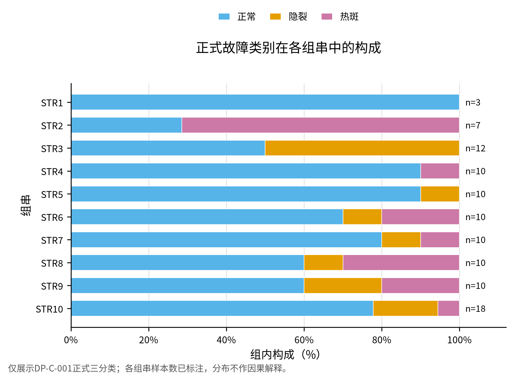
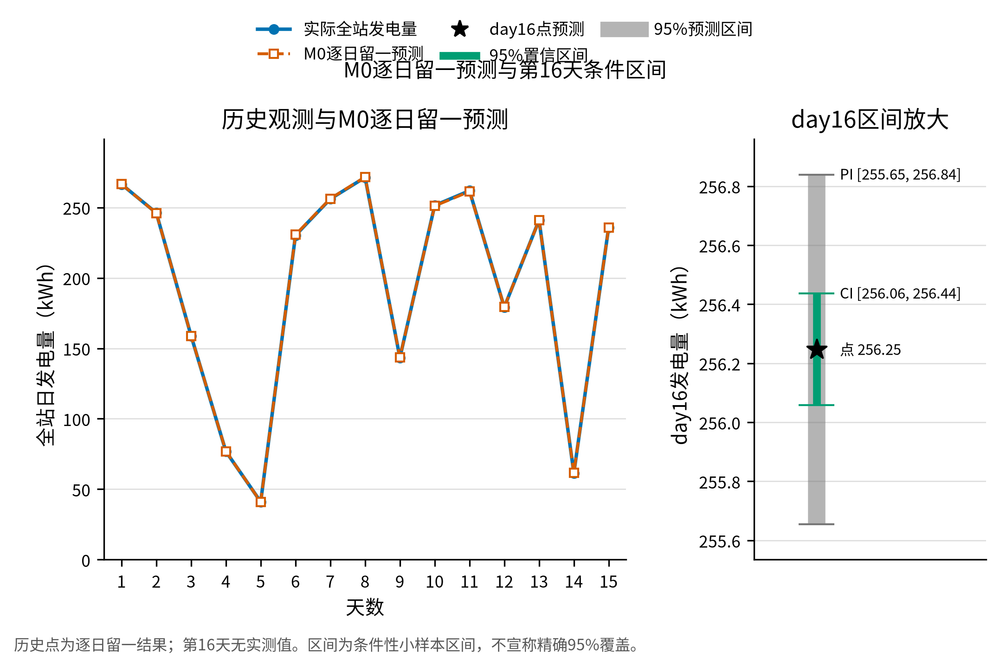
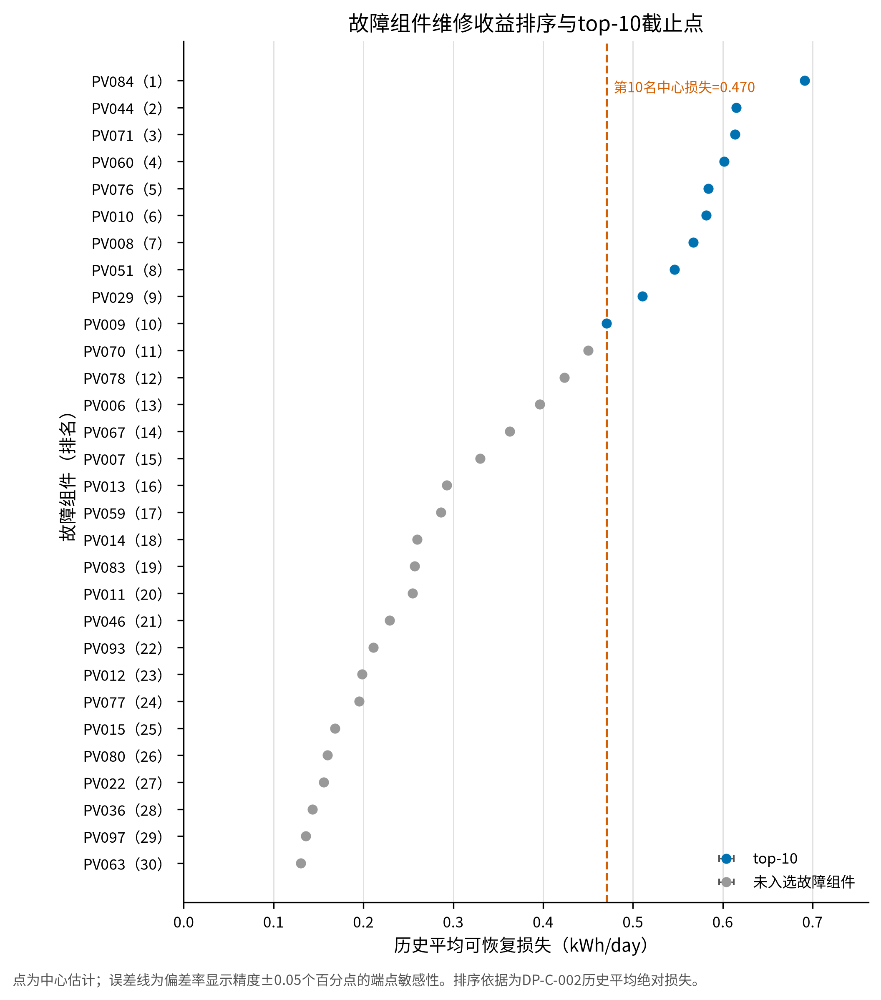

# 某分布式光伏电站组件故障诊断与发电量预测

## 摘要

针对一个含100块组件的分布式光伏电站，本文利用组件15日发电量、题目给定偏差率及同期气象数据，依次完成故障诊断、全站发电量预测和有限预算下的维修排序。任务一直接按照题目给出的偏差率阈值进行三分类，得到正常、隐裂和热斑组件分别为70、15和15块；每日输出仅用于补充遮挡现场复核提示，不覆盖主诊断。任务二以“日”为独立样本单位比较三类站级候选模型，采用逐日留一验证和一标准误差简约规则选择M0辐照度比例模型，其留一平均绝对误差为0.181 kWh。根据第16日气象预报，当前运行状态下全站发电量点预测为256.247 kWh，条件95%期望值置信区间为[256.058, 256.436] kWh，单日预测区间为[255.655, 256.839] kWh。任务三将故障组件按15日历史平均每日绝对可恢复损失排序，在等预算、独立且可加的维修假设下确定前10维修名单，历史平均每日增发量为5.781 kWh，反事实相对提升率为2.969%；按固定比例映射到第16日的补充增发量为7.608 kWh。本文结论适用于题目给定的偏差率定义、15日观测范围和上述维修可加假设，不将筛查提示解释为物理确诊，也不将条件区间解释为精确覆盖率或实际维修效果保证。

**关键词：** 光伏组件；故障诊断；留一验证；发电量预测；维修排序

## 一、问题分析

### 1.1 问题重述

电站由100块额定功率相同的光伏组件组成，组件经组串、汇流和逆变器接入电网。题目给出了每块组件连续15日的发电量、15日平均发电量偏差率、组串和安装参数，以及同期15日气象数据和第16日气象预报[1]。要求在保持题目故障定义的前提下回答三个相互衔接的问题：

1. 根据偏差率判定正常、隐裂和热斑状态，并考察故障在组串、方位角、倾角和投运年限上的分布；
2. 以全站每日总发电量为目标，利用气象条件预测第16日当前未修复状态下的总发电量并给出不确定性范围；
3. 在最多修复10块组件的预算约束下，按可恢复发电量确定优先维修名单，并估算历史口径下的增发量以及第16日条件下的补充增发量。

### 1.2 任务之间的关系

三项任务并非三个独立的排序或预测问题。任务一首先给出进入维修候选集的故障组件；任务二使用所有组件的每日总量建立站级条件预测，不把100块组件的重复观测误当成100倍的独立气象样本；任务三的主排序继承任务一的故障集合，并严格采用15日历史平均每日绝对可恢复损失这一口径。第16日预测只用于将已经确定的维修集合映射到该日天气条件下的补充增发量，不反向改变历史主排序。

因此，本文把正式输出分为三层：偏差率阈值给出的主诊断，时间波动筛查给出的辅助提示，以及在明确反事实和可加性条件下的预测与维修收益估计。这样既利用了每日数据中的时间信息，又不以辅助指标替换题目已经规定的诊断和排序定义。

## 二、模型假设与符号说明

### 2.1 模型假设

（1）题目给出的15日平均偏差率是任务一的正式诊断指标；参考示例标签只在独立分类完成后用于核验。

（2）所有组件的日发电量均以kWh计，电站日总发电量等于100块组件日发电量之和。任务二的独立样本单位为“日”，因此有效气象场景数为15个。

（3）维修后组件恢复到题目偏差率定义中的正常反事实状态。由于题目未给出不等维修成本、串联电流曲线、逆变器限发或共享停机信息，维修增益在任务三中按组件独立且可加处理。

（4）遮挡辅助筛查只反映与正常同伴相比的时间波动异常。它可能受到传感器误差等因素影响，不能覆盖偏差率三分类，也不能单独证明热斑、隐裂或遮挡的物理成因。

### 2.2 符号说明

| 符号 | 含义 | 单位 |
|:---:|:---|:---:|
| $i$ | 组件编号索引 | — |
| $d$ | 观测日索引，$d=1,\ldots,15$ | 日 |
| $E_{id}$ | 组件$i$在第$d$日的实际发电量 | kWh |
| $b_i$ | 组件$i$的给定15日平均偏差率（小数形式） | — |
| $H_d$ | 第$d$日总辐照量 | kWh/m² |
| $T_d,W_d$ | 第$d$日平均温度、平均风速 | ℃，m/s |
| $Y_d$ | 电站第$d$日总发电量 | kWh |
| $\bar E_i$ | 组件$i$的15日平均实际发电量 | kWh/day |
| $\bar E_i^{(0)}$ | 正常反事实下组件$i$的平均发电量 | kWh/day |
| $L_i$ | 组件$i$的平均每日绝对可恢复损失 | kWh/day |

## 三、任务一：组件故障诊断与分布分析

### 3.1 偏差率阈值分类

题目已经给出偏差率的物理含义和三类阈值，因此任务一不再从参考标签反推分类器，而是直接把给定偏差率转为小数后进行确定性判别。对组件$i$，分类函数为

$$
C_i=
\begin{cases}
\text{正常},& |b_i|\le 0.05,\\
\text{隐裂},& -0.15\le b_i<-0.05,\\
\text{热斑},& b_i<-0.15.
\end{cases}
\tag{1}
$$

题目没有定义$b_i>0.05$时的三分类含义，因此该区域不应被强行归类。当前数据中没有组件落入该区域，故全部100块组件均能按式（1）完成分类。分类完成后再与参考示例比较，作为独立核验而不是模型输入。

### 3.2 遮挡辅助筛查

偏差率适合识别持续的平均损失，但遮挡可能表现为随时间变化的异常。为减少辐照度变化的影响，对$H_d>0$的日期构造归一化输出

$$
q_{id}=\frac{E_{id}}{H_d}.
\tag{2}
$$

对每块组件优先选择与其方位角、倾角相同且已判为正常的同伴；同配置正常同伴少于5块时，回退到全部正常组件。设该同伴集合为$P_i$，以同伴每日中位数作为参照，并定义组件相对同伴的对数序列

$$
r_{id}=\log\left(\frac{q_{id}}{\operatorname{median}_{j\in P_i}q_{jd}}\right).
\tag{3}
$$

以稳健MAD尺度评估$r_{id}$的时间离散程度：只有当离散度超过正常同伴基线的稳健阈值，且至少两天出现同向或相邻异常时，才满足一种参照体系下的疑似遮挡条件。为降低同伴选择的影响，分别使用同配置正常同伴和全部正常组件两种参照；两者均标记时记为“疑似遮挡”，结果不一致时记为“筛查不稳定”，均未标记时记为“未发现疑似遮挡”。该筛查只提供现场复核优先级，不改变式（1）的类别。

### 3.3 诊断结果与分布

分类结果如表1所示。正常组件70块，占70%；隐裂和热斑各15块，分别占15%。三类数量合计100，且与参考示例的独立核验一致率为100%。图1给出按组串汇总的组成比例，用于观察故障的集中位置；图中比例是描述性统计，不代表组串、方位角、倾角或投运年限对故障的因果影响。

**表1 任务一主诊断与遮挡筛查汇总**

| 指标 | 数值 | 口径 |
|:---|---:|:---|
| 正常组件数 | 70 | 式（1）正式分类 |
| 隐裂组件数 | 15 | 式（1）正式分类 |
| 热斑组件数 | 15 | 式（1）正式分类 |
| 超出三分类定义域 | 0 | 正偏差超过5%的记录 |
| 分类完整率 | 100.0% | 进入题目三分类定义域的组件比例 |
| 参考示例一致率 | 100.0% | 分类完成后的独立核验 |
| 疑似遮挡 | 3 | 辅助筛查，不覆盖正式类别 |
| 筛查不稳定 | 12 | 辅助筛查，不覆盖正式类别 |

{width=90%}

*图1 100块组件按组串的正式三分类构成。颜色和标注只表达式（1）的类别分布；遮挡筛查不参与该图的分类。*

从描述性比例看，STR2中热斑为5/7（71.4%），STR3中隐裂为6/12（50.0%），是相应组串中的较高比例；STR10虽然包含4块故障组件，但因总数为18块，故障比例为22.2%。按安装参数汇总，方位角175°、倾角24°的组合中故障13/32（40.6%），方位角180°、倾角25°的组合中故障7/41（17.1%），方位角185°、倾角26°的组合中故障10/27（37.0%）。按投运年限，1、2、3年组件的故障比例分别为21.4%、32.5%和34.4%。这些比例只描述当前样本中的集中现象；由于组串、安装参数和年限在布局中同步变化，不能据此把差异归因于某一个因素。

遮挡状态与正式类别的交叉结果见表2。3块“疑似遮挡”组件全部同时属于热斑类别，但这只能说明筛查提示与主分类在本数据中的交集，不能据此断言遮挡造成了热斑。另有12块组件在两种参照体系下结论不一致，其中正常、隐裂和热斑分别有2、4和6块，说明辅助筛查应当作为现场检查提示，而不是替代偏差率诊断。

**表2 正式类别与遮挡辅助筛查交叉表**

| 正式类别 | 未发现疑似遮挡 | 筛查不稳定 | 疑似遮挡 | 合计 |
|:---|---:|---:|---:|---:|
| 正常 | 68 | 2 | 0 | 70 |
| 隐裂 | 11 | 4 | 0 | 15 |
| 热斑 | 6 | 6 | 3 | 15 |
| 合计 | 85 | 12 | 3 | 100 |

## 四、任务二：全站第16日发电量预测

### 4.1 站级响应与候选模型

将组件日发电量在站内求和，得到当前未修复运行状态下的站级响应

$$
Y_d=\sum_{i=1}^{100}E_{id}.
\tag{4}
$$

固定的组件方位角和倾角在站级日总量中不随$d$变化，其作用被总体性能系数吸收；天气类型与辐照度高度相关且类别样本较少，因此不作为主候选特征。围绕“太阳辐照决定发电量、温度和风速可能修正转换效率”的最小结构，比较以下三个候选模型。

第一，M0为辐照度比例模型

$$
Y_d=\beta_H H_d+\varepsilon_d.
\tag{5}
$$

它在零辐照时给出零基准发电量，并用一个站级系数概括固定组件组合的平均性能。第二，M1加入截距作为对M0系统性失配的诊断

$$
Y_d=\alpha+\beta_HH_d+\varepsilon_d.
\tag{6}
$$

第三，M2使用以历史均值为中心的温度和风速修正效率

$$
Y_d=H_d\left[\beta_0+\beta_T(T_d-\bar T)+\beta_W(W_d-\bar W)\right]+\varepsilon_d,
\quad \beta_0\ge0,\ \beta_T\le0,\ \beta_W\ge0.
\tag{7}
$$

式（7）的符号约束体现有限的物理先验，但不保证温度、风速效应能由15个日样本稳定识别。若扩展模型的系数频繁落在约束边界、接近零或对删除某一天敏感，则其表面拟合改善不能作为采用该模型的理由。

### 4.2 候选比较与模型选择

以日为留出单位对所有候选模型进行15折逐日留一验证，主指标为留一平均绝对误差（MAE），RMSE、最大绝对误差和$R^2$作为辅助指标。先排除设计矩阵不满秩、预测为负、物理符号不合理或参数不稳定的候选，再在合格模型中使用一标准误差规则：MAE位于最小值加一个标准误以内的模型进入简约集合，并选取其中参数最少者。

**表3 候选模型的逐日留一比较**

| 模型 | 合格性 | 留一MAE/kWh | 留一RMSE/kWh | 最大绝对误差/kWh | 留一$R^2$ | 全样本$R^2$ | 一标准误集合 | 选择结果 |
|:---:|:---|---:|---:|---:|---:|---:|:---:|:---:|
| M0 | 是 | 0.181 | 0.238 | 0.571 | 0.999991 | 0.999992 | 是 | 选中 |
| M1 | 是 | 0.188 | 0.240 | 0.564 | 0.999990 | 0.999992 | 是 | 否 |
| M2 | 否 | 0.187 | 0.244 | 0.593 | 0.999990 | 0.999992 | 否 | 否 |

M0的留一MAE最小，为0.181 kWh；以最小MAE加一个标准误得到的阈值为0.222 kWh，M1的误差略大但仍落入一标准误集合，因此不需要用截距换取难以区分的微小改善。M2虽然在数值上比M1的MAE略低，但温度项全样本估计接近零、在留一拟合中多次落到零边界，风速项在删去单日后变化超过100%，故不具备稳定的参数解释和预测资格。由此选择M0。这个选择来自误差、资格和简约性共同作用，而不是预先指定M0获胜。

图2左图展示M0在15个历史日上的逐日留一预测与实际总量；低辐照日和高辐照日均沿同一比例关系变化，最大留一绝对误差为0.571 kWh。图2右图单独放大第16日区间，以避免窄区间在全量程图中难以辨认。

{width=94%}

*图2 左：M0的15日逐日留一预测；右：第16日点预测、95%期望值置信区间和95%单日预测区间。区间以已观测历史条件和给定第16日气象预报为条件。*

### 4.3 第16日点预测与区间

M0选定后，在全部15个历史日上重新拟合原尺度的站级响应，得到

$$
\hat\beta_H=51.249391.
\tag{8}
$$

第16日预报辐照度为$H_{16}=5.0$ kWh/m²，因此正式点预测由同一个全15日原尺度拟合直接给出

$$
\hat Y_{16}=\hat\beta_HH_{16}
=51.249391\times5.0
\approx256.247\ \text{kWh}.
\tag{9}
$$

点预测保持在$Y$尺度上。区间计算采用HC3稳健参数协方差[2]，并按辐照度缩放条件残差方差以反映日级波动。该处理只改变不确定性范围，不重新定义或替换式（5）的点预测模型。结果见表4。

**表4 第16日全站发电量预测**

| 输出 | 点预测/kWh | 下界/kWh | 上界/kWh | 解释范围 |
|:---|---:|---:|---:|:---|
| 点预测 | 256.247 | — | — | M0全15日原尺度最终拟合 |
| 95%期望值置信区间 | — | 256.058 | 256.436 | 条件性参数不确定性 |
| 95%单日预测区间 | — | 255.655 | 256.839 | 条件性参数与日级残差不确定性 |

预测区间包含单日残差波动，因此宽于期望值置信区间。作为敏感性核对，再以同一M0定义按辐照度缩放残差重采样并在原尺度重拟合[3]，所得区间与主区间接近，未改变第16日判断。由于只有15个历史日，上述“95%”是模型条件下的区间标记，不能被解释为精确覆盖率的证明；第16日气象预报本身的误差、候选模型选择不确定性、未来故障状态变化、限发和逆变器事件也未纳入区间。

## 五、任务三：有限预算下的维修排序与增发量

### 5.1 历史可恢复损失

任务三只对任务一判定为隐裂或热斑的30块组件排序。令组件$i$的15日平均实际发电量为

$$
\bar E_i=\frac{1}{15}\sum_{d=1}^{15}E_{id}.
\tag{10}
$$

由题目偏差率定义

$$
b_i=\frac{\bar E_i-\bar E_i^{(0)}}{\bar E_i^{(0)}},
$$

可反推出正常反事实平均发电量

$$
\bar E_i^{(0)}=\frac{\bar E_i}{1+b_i}.
\tag{11}
$$

因此，组件$i$的历史平均每日绝对可恢复损失为

$$
L_i=\bar E_i^{(0)}-\bar E_i
=-\frac{b_i}{1+b_i}\bar E_i,\qquad \text{kWh/day}.
\tag{12}
$$

当前30块故障组件的偏差率均满足$-1<b_i<0$，所以式（12）给出的损失均为正。主排序使用$L_i$而不是百分比偏差或第16日的条件增益，因而与15日历史平均绝对可恢复损失这一目标一致。

### 5.2 等预算下的前10名交换论证

设维修集合为$S$，在每块组件占用相同预算、最多维修10块、组件损失非负且相互独立的条件下，集合收益为

$$
G(S)=\sum_{i\in S}L_i.
\tag{13}
$$

若某个10块集合包含损失较小的组件$j$，而集合外存在$L_k>L_j$的组件$k$，用$k$替换$j$后仍满足预算约束，且集合收益增加$L_k-L_j$。反复交换可知，将$L_i$降序排列并取前10名即为式（13）目标下的精确最优集合。该结论依赖等成本、独立可加和以及最多10块这三个条件；它不是对真实电气耦合系统的普遍最优性断言。

### 5.3 优先维修名单

**表5 前10块优先维修组件及历史可恢复损失**

| 排名 | 组件 | 类别 | 偏差率/% | 正常反事实/kWh/day | 可恢复损失/kWh/day | 累计损失/kWh/day |
|---:|:---:|:---:|---:|---:|---:|---:|
| 1 | PV084 | 热斑 | -33.1 | 2.089 | 0.691 | 0.691 |
| 2 | PV044 | 热斑 | -29.3 | 2.099 | 0.615 | 1.306 |
| 3 | PV071 | 热斑 | -30.1 | 2.038 | 0.614 | 1.920 |
| 4 | PV060 | 热斑 | -28.8 | 2.089 | 0.602 | 2.521 |
| 5 | PV076 | 热斑 | -28.1 | 2.078 | 0.584 | 3.105 |
| 6 | PV010 | 热斑 | -29.5 | 1.971 | 0.581 | 3.687 |
| 7 | PV008 | 热斑 | -28.7 | 1.977 | 0.567 | 4.254 |
| 8 | PV051 | 热斑 | -26.0 | 2.101 | 0.546 | 4.800 |
| 9 | PV029 | 热斑 | -24.7 | 2.068 | 0.511 | 5.311 |
| 10 | PV009 | 热斑 | -23.7 | 1.985 | 0.470 | 5.781 |

图3显示全部30块故障组件的损失排序、前10名和第10/11名截止点。第10名PV009的中心损失为0.470 kWh/day，第11名PV070为0.450 kWh/day。考虑给定偏差率的显示精度，在偏差率上下各扰动0.05个百分点后，二者的损失区间分别为[0.469, 0.472]和[0.449, 0.452] kWh/day，区间不重叠，因此主名单不会因该显示精度引起的截止点交换而改变。

{width=94%}

*图3 30块故障组件的15日历史平均每日可恢复损失。蓝色为前10名，虚线为维修预算截止位置，误差线表示偏差率显示精度导致的损失端点范围。*

### 5.4 历史口径的全站提升

前10块组件的历史平均每日增发量就是其损失之和

$$
G_{\mathrm{hist}}=\sum_{i\in S_{10}}L_i\approx5.781\ \text{kWh/day}.
\tag{14}
$$

当前全站15日平均发电量为194.736 kWh/day，在完全恢复且收益可加的反事实下，修复后全站平均发电量为

$$
\bar Y_{\mathrm{post}}\approx194.736+5.781
\approx200.517\ \text{kWh/day}.
\tag{15}
$$

相对提升率为

$$
\frac{5.781}{194.736}\times100\%\approx2.969\%.
\tag{16}
$$

式（14）—（16）是基于题目定义的正常反事实和可加性假设的历史估计，不是对维修后实际输出的观测，也不包含维修有效率、停机时间、组串耦合或逆变器限发造成的偏差。

### 5.5 第16日条件下的补充增发量

第16日增发量用于描述已确定的前10维修集合在新天气条件下的补充结果，不改变式（12）的历史排序。令任务二的第16日点预测为$\hat Y_{16}$，历史全站平均为$\bar Y$，固定比例为

$$
s_{16}=\frac{\hat Y_{16}}{\bar Y}.
$$

则在比例关系保持不变的条件下，前10集合的第16日补充增发量为

$$
G_{16}=G_{\mathrm{hist}}s_{16}
=G_{\mathrm{hist}}\frac{\hat Y_{16}}{\bar Y}
\approx7.608\ \text{kWh}.
\tag{17}
$$

区间也使用同一个固定比例缩放：将任务二期望值置信区间的两个端点分别乘以$G_{\mathrm{hist}}/\bar Y$，得到补充增发量的条件95%区间[7.602, 7.613] kWh；将任务二单日预测区间以同样比例缩放，得到[7.590, 7.625] kWh。这样传播的只是任务二的站级参数不确定性和条件日级残差波动；维修名单、历史损失和比例关系均保持不变，偏差率舍入、正常反事实误差、维修有效率、组串耦合、加性假设、模型选择和第16日气象预报输入误差均未传播到式（17）。

## 六、模型评价与适用边界

### 6.1 模型优点

第一，任务一的主诊断直接使用题目规定的偏差率阈值，分类逻辑透明，且将时间波动信息放在不覆盖主分类的辅助筛查中。第二，任务二把组件数据先聚合为站级日总量，以日为独立样本进行候选比较，避免由组件重复观测造成虚假的样本量；M0的选择同时考虑了留出误差、参数资格和简约性。第三，任务三把偏差率定义代数反演为可恢复损失，并用交换论证说明了前10排序在明确条件下的最优性，因而不需要引入与题目数据不匹配的复杂组合算法。

### 6.2 局限与可推广条件

（1）主诊断依据的是统计偏差率，不等同于红外、I–V或电致发光检测得到的物理确诊；遮挡筛查也可能混入传感器异常。组串、方位角、倾角和投运年限在当前布局中存在结构性混杂，分布差异不能直接解释为这些因素的因果作用。

（2）任务二只有15个历史日，且第16日预测依赖气象预报和故障状态在短期内保持可比。区间反映的是给定输入、选定M0和当前残差结构下的条件不确定性，不能据此宣称精确95%覆盖率或对更长时间范围作无条件外推。

（3）任务三的收益估计假定维修可以完全恢复题目定义的正常反事实，且各组件收益可加。若实际存在部分修复、不同维修成本、维修停机、串联失配、逆变器限发或共享约束，当前的损失排序和增发量解释需要重新评估。尤其是第16日补充增发量只是固定比例缩放的条件估计，不是实测维修效果。

## 七、结论

（1）按题目偏差率阈值，100块组件中正常70块、隐裂15块、热斑15块，没有超出三分类定义域的记录。时间波动筛查只作为现场复核提示，不覆盖主诊断。

（2）以站级日总发电量为目标并进行逐日留一比较后，选择M0辐照度比例模型。该模型给出的第16日当前运行状态点预测为256.247 kWh，条件95%期望值置信区间为[256.058, 256.436] kWh，条件95%单日预测区间为[255.655, 256.839] kWh。

（3）在等预算、独立可加和完全恢复的反事实下，优先维修PV084、PV044、PV071、PV060、PV076、PV010、PV008、PV051、PV029和PV009。该集合的历史平均每日可恢复损失为5.781 kWh，对应反事实相对提升率为2.969%；按同一固定比例映射到第16日的条件性补充增发量为7.608 kWh。该补充量不改变历史主排序，也不代表实际维修后的保证收益。

## 参考文献

[1] 题目组. C题：某分布式光伏电站组件故障诊断与发电量预测及配套数据[数据集]. 2026年夏季数学建模练习题，2026.

[2] MacKinnon J G, White H. Some heteroskedasticity-consistent covariance matrix estimators with improved finite sample properties[J]. Journal of Econometrics, 1985, 29(3): 305-325. DOI: 10.1016/0304-4076(85)90158-7.

[3] Efron B. Bootstrap methods: Another look at the jackknife[J]. The Annals of Statistics, 1979, 7(1): 1-26. DOI: 10.1214/aos/1176344552.
